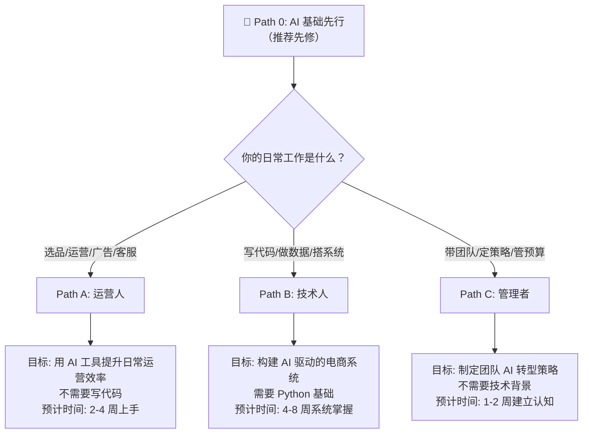
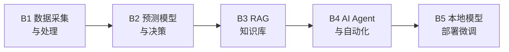

# ecommerce-ai-roadmap: AI × Cross-Border E-Commerce Knowledge Hub

> 跨境电商 AI 实战知识库 | The Definitive AI Guide for Cross-Border E-Commerce

[](https://github.com/kangise/ecommerce-ai-roadmap)
[](https://github.com/kangise/ecommerce-ai-roadmap)
[](https://creativecommons.org/publicdomain/zero/1.0/)

**原创实战内容，不是链接聚合。** 12 个可直接复制的 Prompt 模板 · 3 条学习路径 · 实战案例
**Original hands-on content, not a link aggregator.** 12 ready-to-use prompts · 3 learning paths · real-world case studies

🇨🇳 中文 | 🇺🇸 [English](README_EN.md)

---

### 🚀 30 秒体验 AI 选品 | Try AI Product Research in 30 Seconds

复制下面的 Prompt 到 [ChatGPT](https://chat.openai.com/) 或 [Claude](https://claude.ai/)，立即获得市场分析：

```
你是一个资深的跨境电商运营专家，精通 Amazon 平台。
我想在 Amazon US 销售一款便携式颈挂风扇（Neck Fan）。
请帮我做一个快速的市场可行性分析，包含：
1. 这个品类的市场特征（季节性、竞争程度、价格带）
2. TOP 3 竞品的核心卖点和差评中的主要痛点
3. 3个可能的差异化方向
4. 风险提示（合规、专利、季节性库存风险）
请用表格形式呈现关键数据对比。
```

👆 你会在 30 秒内得到一份市场分析。更多 Prompt → [Prompt 模板库](prompts/)

---

## 🆕 What's New

- 📅 2025-06-20: 新增 [Notebook 实验室](notebooks/) — 首个 Notebook: Amazon 报告数据处理 [](https://colab.research.google.com/github/kangise/ecommerce-ai-roadmap/blob/main/notebooks/b1-data-pipeline.ipynb)
- 📅 2025-06-20: 新增 2 个实战案例: [AI Listing 生成](docs/case-studies/ai-listing-generation.md)、[自动化 Review 分析](docs/case-studies/automated-review-analysis.md)
- 📅 2025-06-20: 新增 [README_EN.md](README_EN.md) 英文完整版 + 社区基础设施（Issue 模板、CODEOWNERS、CHANGELOG）

---

## 📋 目录 | Table of Contents

- [🆕 What's New](#-whats-new)
- [🔥 Top 10 Prompts（即刻可用）](#-top-10-prompts即刻可用)
- [选择你的路径 | Choose Your Path](#选择你的路径)
- [Path A: 运营人 — AI 提效实战](#path-a-运营人--ai-提效实战)
- [Path B: 技术人 — AI 系统构建](#path-b-技术人--ai-系统构建)
- [Path C: 管理者 — AI 战略落地](#path-c-管理者--ai-战略落地)
- [Prompt 模板库](#prompt-模板库)
- [Notebook 实验室](#notebook-实验室)
- [学习路径追踪](#学习路径追踪)
- [AAAI China Chapter 社群](#aaai-china-chapter-社群)
- [Contributors](#contributors)
- [贡献指南](#贡献指南)

---

## 🔥 Top 10 Prompts（即刻可用）

从 [Prompt 模板库](prompts/) 精选的 10 个最实用模板，复制到 ChatGPT / Claude 即可使用。

**1. 竞品 Review 痛点分析** — 从差评中提取产品改进方向
```
你是一个资深的 Amazon 产品经理。我会给你一组竞品的 1-3 星差评。
请分析这些差评，输出：排名前5的用户痛点（按频率排序）、每个痛点的代表性评论原文、改进建议、难度评估。用表格呈现。
[在此粘贴差评内容]
```
[更多 → prompts/product-research.md](prompts/product-research.md#模板-1-竞品-review-痛点分析)

**2. 市场可行性快速评估** — 5 维度评分判断是否值得进入
```
你是一个跨境电商选品专家。请对以下产品做市场可行性评估：
产品：[产品名称]  目标市场：Amazon [US/DE/JP]
从市场需求、竞争强度、利润空间、供应链难度、合规风险 5 个维度分析，每项 1-5 分。
最后给出综合建议：进入 / 谨慎 / 放弃。
```
[更多 → prompts/product-research.md](prompts/product-research.md#模板-2-市场可行性快速评估)

**3. Listing 全套生成** — 一次生成标题、五点、描述、Search Terms
```
你是一个 Amazon Listing 优化专家，精通 [目标市场] 市场。
产品：[名称]  卖点：[卖点1/2/3]  关键词：[关键词列表]
请生成：标题（≤200字符）、5个 Bullet Points、产品描述（≤200字）、后台 Search Terms（5行）。
关键词自然融入，突出差异化。
```
[更多 → prompts/listing-optimization.md](prompts/listing-optimization.md#模板-1-listing-全套生成)

**4. 多语言本地化** — 不是直译，是适配当地市场
```
你是精通 [目标语言] 的 Amazon Listing 本地化专家。
[粘贴英文 Listing]
请翻译为 [目标语言]，注意：符合当地搜索习惯、替换为本地关键词、调整卖点顺序、标注所有本地化调整及原因。
```
[更多 → prompts/listing-optimization.md](prompts/listing-optimization.md#模板-2-多语言本地化)

**5. 竞品 Listing 策略拆解** — 对比分析找差异化定位
```
分析以下 3 个竞品的 Amazon Listing，对比策略差异：
[竞品A/B/C 标题和五点]
输出：各自核心定位、共同卖点、差异化机会、关键词覆盖对比表、我的差异化建议。
```
[更多 → prompts/listing-optimization.md](prompts/listing-optimization.md#模板-3-竞品-listing-策略拆解)

**6. 搜索词报告分析** — 找出广告浪费和优化机会
```
你是 Amazon PPC 广告优化专家。以下是我的搜索词报告（过去30天）：
[粘贴数据]
输出：高转化词 TOP 10、高花费低转化词 TOP 10、低 CTR 词分析、否定关键词建议、预算重新分配方案。
```
[更多 → prompts/advertising.md](prompts/advertising.md#模板-1-搜索词报告分析)

**7. 广告文案 A/B 测试** — 5 种风格的 Headline 变体
```
产品：[产品描述]  卖点：[核心卖点]
为 Sponsored Brands 生成 5 个 Headline（≤50字符）：功能导向、场景导向、情感导向、数据导向、问题解决型。
每个标注预期效果和适合受众。
```
[更多 → prompts/advertising.md](prompts/advertising.md#模板-2-广告文案-ab-测试)

**8. 差评批量分析** — 分类问题并制定改善方案
```
你是电商产品质量分析师。以下是最近60天的1-3星评论。
请：按类型分类（质量/功能/物流/使用困难/预期不符）、统计频率占比、每类3条代表性评论、短期应对+长期改善方案、优先级排序。
[粘贴差评]
```
[更多 → prompts/customer-service.md](prompts/customer-service.md#模板-1-差评批量分析)

**9. 账号申诉信** — 专业的 Plan of Action
```
你是 Amazon 账号申诉专家。我的账号因以下原因被暂停：
[粘贴违规通知]
请撰写 Plan of Action：Root Cause（承认问题）、Immediate Actions（已采取措施）、Preventive Measures（长期预防）。语气诚恳专业，每部分列出具体行动项。
```
[更多 → prompts/customer-service.md](prompts/customer-service.md#模板-2-账号申诉信-plan-of-action)

**10. 多市场合规对比** — 快速生成合规清单
```
我要在 Amazon [US/DE/JP] 销售 [产品类型]。
请生成合规对比表：每个市场的产品认证、包装标签要求、特殊品类要求、预估费用和周期、常见合规陷阱。
标注信息时效性，建议向认证机构确认。
```
[更多 → prompts/compliance.md](prompts/compliance.md#模板-1-多市场合规对比)

> 📖 查看完整模板（含预期输出、使用技巧）→ [Prompt 模板库](prompts/README.md)

[回到目录](#-目录--table-of-contents)

---

## 选择你的路径

> 🌟 **推荐先修**：无论你选择哪条路径，建议先完成 [Path 0: AI 基础先行](paths/0-foundations/)，建立 AI 认知基础（LLM 原理、Prompt 工程、RAG、Agent）。



| 路径 | 适合谁 | 需要写代码吗 | 时间投入 | 核心产出 |
|------|--------|-------------|----------|----------|
| **[Path 0: AI 基础先行](paths/0-foundations/)** 🌟 | 所有人（推荐先修） | 不需要 | 每天30分钟，1周 | AI 认知基础 |
| **[Path A: 运营人](paths/a-operators/)** | 选品/运营/广告/客服岗 | 不需要 | 每天30分钟，2-4周 | 一套可复用的 AI 工作流 |
| **[Path B: 技术人](paths/b-developers/)** | 开发/数据/BI 岗 | 需要 Python | 每天1小时，4-8周 | 一个可部署的 AI 工具 |
| **[Path C: 管理者](paths/c-managers/)** | 团队负责人/创始人 | 不需要 | 集中3-5小时 | 一份 AI 落地规划书 |

> 🗺️ **推荐**：完成 Path 0 后、进入具体路径前，先看 [AI 应用全景评估](paths/0-foundations/ai-landscape.md) — 30 分钟了解每个环节 AI 能做到什么程度、优先级如何排序。

> 不确定选哪条？三条路径可以交叉学习。运营人学完 Path A 想深入，可以进 Path B；管理者想了解细节，可以看 Path A 的具体模块。

[回到目录](#-目录--table-of-contents)

---

## Path A: 运营人 — AI 提效实战

> 目标：不写一行代码，用 AI 工具把日常运营效率提升 3-10 倍
>
> 前提：你已经有基本的电商运营经验（知道什么是 ASIN、PPC、FBA）
>
> 时间：每天 30 分钟，2-4 周完成全部模块

📖 [查看 Path A 完整内容 →](paths/a-operators/)

| 模块 | 主题 | 你将学会 |
|------|------|----------|
| [A1. 选品与市场洞察](paths/a-operators/a1-product-research.md) | 竞品分析、市场评估 | 用 AI 完成选品可行性分析报告 |
| [A2. Listing 与内容创作](paths/a-operators/a2-listing-optimization.md) | Listing 生成、多语言翻译 | 用 AI 生成完整的多语言 Listing |
| [A3. 广告优化](paths/a-operators/a3-advertising.md) | 搜索词分析、文案测试 | 用 AI 分析搜索词报告并优化 |
| [A4. 客服与售后](paths/a-operators/a4-customer-service.md) | 差评分析、申诉信撰写 | 建立多语言客服回复模板库 |
| [A5. 库存与供应链](paths/a-operators/a5-inventory.md) | 补货预测、安全库存 | 用 AI 建立补货决策模型 |
| [A6. 合规与风控](paths/a-operators/a6-compliance.md) | 多市场合规、认证查询 | 生成完整的多市场合规清单 |

[回到目录](#-目录--table-of-contents)

---

## Path B: 技术人 — AI 系统构建

> 目标：构建 AI 驱动的电商工具和系统，从脚本到产品级应用
>
> 前提：有 Python 基础（或愿意边学边做，AI 会帮你写代码）
>
> 时间：每天 1 小时，4-8 周系统掌握

📖 [查看 Path B 完整内容 →](paths/b-developers/)



| 模块 | 主题 | 你将构建 |
|------|------|----------|
| [B1. 数据采集与处理](paths/b-developers/b1-data-pipeline.md) | pandas、SP-API、自动化 | 自动合并 Amazon 报告的脚本 |
| [B2. 预测模型与决策](paths/b-developers/b2-prediction-models.md) | Prophet、AutoGluon | SKU 90 天销量预测模型 |
| [B3. RAG 知识库](paths/b-developers/b3-rag-knowledge-base.md) | LlamaIndex、Chroma | 产品 FAQ AI 问答系统 |
| [B4. AI Agent 与自动化](paths/b-developers/b4-agent-workflow.md) | LangGraph、CrewAI | 自动化运营监控 Agent |
| [B5. 本地模型部署](paths/b-developers/b5-local-model-deploy.md) | Ollama、LoRA 微调 | 本地运行的电商 LLM（选修） |

> 完成 B1-B4 中至少 3 个模块，你已经具备构建 AI 电商工具的能力。B5 为进阶选修。

[回到目录](#-目录--table-of-contents)

---

## Path C: 管理者 — AI 战略落地

> 目标：理解 AI 能为团队做什么，制定可执行的 AI 落地计划
>
> 前提：不需要技术背景，但需要对业务有深入理解
>
> 时间：集中 3-5 小时完成评估和规划

📖 [查看 Path C 完整内容 →](paths/c-managers/)

| 模块 | 主题 | 你将产出 |
|------|------|----------|
| [C1. AI 能力评估与规划](paths/c-managers/c1-ai-assessment.md) | 落地优先级矩阵、规划 Prompt | 团队 AI 能力评估和优先级排序 |
| [C2. 团队 AI 技能建设](paths/c-managers/c2-team-building.md) | 培训计划、习惯养成 | 团队 80%+ 每天使用 AI 工具 |
| [C3. AI 项目 ROI 评估](paths/c-managers/c3-roi-evaluation.md) | ROI 计算框架、效果衡量 | 至少一个 AI 项目的 ROI 评估报告 |

> 完成以上 3 个模块，输出一份完整的团队 AI 落地规划书（包含优先级、时间线、预算、KPI）。

[回到目录](#-目录--table-of-contents)

---

## Path D: 多平台 — 超越 Amazon

> 🆕 把 AI 能力从 Amazon 扩展到 Shopify 独立站、TikTok Shop 等平台。
>
> 前置：建议先完成 Path A 的核心模块

📖 [查看 Path D 完整内容 →](paths/d-platforms/)

| 模块 | 平台 | 核心内容 |
|------|------|----------|
| [D1. Shopify AI 指南](paths/d-platforms/shopify-ai-guide.md) | Shopify | 选品→产品页→广告→邮件→客服→数据分析全链路 |
| D2. TikTok Shop AI 指南 | TikTok Shop | 短视频生成、达人匹配、直播脚本（即将发布） |
| D3. 跨平台 AI 策略 | 多平台 | Amazon + 独立站 + 社交电商协同（即将发布） |

[回到目录](#-目录--table-of-contents)

---

## Prompt 模板库

所有 Prompt 模板集中在 [`prompts/`](prompts/) 目录，按场景分类，可直接复制使用。

📖 [查看完整 Prompt 模板库 →](prompts/README.md)

| 模板集 | 模板数 | 场景 |
|--------|--------|------|
| [选品与市场分析](prompts/product-research.md) | 3 | 竞品 Review 分析、市场评估、关键词聚类 |
| [Listing 生成与优化](prompts/listing-optimization.md) | 3 | Listing 全套生成、多语言本地化、竞品策略拆解 |
| [广告分析与优化](prompts/advertising.md) | 2 | 搜索词报告分析、广告文案 A/B 测试 |
| [客服与售后](prompts/customer-service.md) | 2 | 差评批量分析、账号申诉信 |
| [合规与风控](prompts/compliance.md) | 1 | 多市场合规对比 |

> 欢迎贡献你验证过的 Prompt 模板！详见 [贡献指南](#贡献指南)。

[回到目录](#-目录--table-of-contents)

---

## Notebook 实验室

可在 Google Colab 直接运行的 Jupyter Notebook，零配置上手。

📋 计划覆盖以下主题（开发中，欢迎贡献）：

- Amazon 报告自动化处理（入门）
- Prophet 销量预测（中级）
- BERTopic Review 主题分析（中级）
- 产品 FAQ 知识库（中级）
- 运营日报自动生成 Agent（高级）

> 关注 [路线图](roadmap/README.md) 了解最新进展。

[回到目录](#-目录--table-of-contents)

---

## 学习路径追踪

复制以下 checklist 到你的笔记工具中，追踪学习进度。

### Path A 进度追踪（运营人）

```
[ ] A1. 选品：用 AI 完成一个完整的选品可行性分析报告
[ ] A2. Listing：用 AI 生成一套完整的多语言 Listing
[ ] A3. 广告：用 AI 分析一份真实的搜索词报告并执行优化
[ ] A4. 客服：建立一套多语言客服回复模板库
[ ] A5. 库存：用 AI 建立一个产品的补货决策模型
[ ] A6. 合规：为一个产品生成完整的多市场合规清单
```

### Path B 进度追踪（技术人）

```
[ ] B1. 数据：写一个脚本自动合并多个 Amazon 报告
[ ] B2. 预测：用 Prophet 对一个真实 SKU 做 90 天销量预测
[ ] B3. RAG：搭建一个可以回答产品问题的 RAG 系统
[ ] B4. Agent：部署一个自动化运营监控 Agent
[ ] B5. 部署：用 Ollama 在本地运行 LLM（选修）
```

### Path C 进度追踪（管理者）

```
[ ] C1. 评估：完成团队 AI 能力评估和优先级排序
[ ] C2. 建设：团队 80%+ 的人每天使用 AI 工具
[ ] C3. ROI：完成至少一个 AI 项目的 ROI 评估报告
```

[回到目录](#-目录--table-of-contents)

---

## AAAI China Chapter 社群

ecommerce-ai-roadmap 是 **AAAI China Chapter (AAAI 中国分会)** 的开源项目之一。我们致力于推动 AI 技术在跨境电商领域的实际应用。

### 加入社群你能获得什么

- **月度 AI Workshop** -- 每月一次线上实战工作坊，跟着做一个完整的 AI 电商项目
- **Prompt 模板共创** -- 社群成员共同维护和优化 Prompt 模板库
- **案例分享** -- 一线操盘手分享 AI 在实际业务中的应用案例和踩坑经验
- **技术答疑** -- 遇到问题可以在社群中获得帮助
- **行业资讯** -- AI 工具更新、平台政策变化的第一手信息

### 如何参与

- Star 本仓库，关注更新
- [提交 Issue](https://github.com/kangise/ecommerce-ai-roadmap/issues) 反馈问题或建议
- [提交 PR](https://github.com/kangise/ecommerce-ai-roadmap/pulls) 贡献 Prompt 模板、Notebook 或案例
- 关注 AAAI China Chapter 获取活动信息

[回到目录](#-目录--table-of-contents)

---

## Contributors

感谢所有为 ecommerce-ai-roadmap 做出贡献的人！ | Thanks to all contributors!

<!-- ALL-CONTRIBUTORS-LIST:START -->
<a href="https://github.com/kangise"></a>
<!-- ALL-CONTRIBUTORS-LIST:END -->

> 🎯 想加入贡献者墙？[提交一个 Prompt 模板](https://github.com/kangise/ecommerce-ai-roadmap/issues/new?template=prompt_submission.md) 就够了！不需要会 PR。

[回到目录](#-目录--table-of-contents)

---

## 贡献指南

我们特别欢迎以下类型的贡献：

1. **Prompt 模板** -- 你在实际工作中验证过的、效果好的 Prompt
2. **Notebook** -- 可在 Colab 运行的实战教程
3. **案例分享** -- 你用 AI 解决了什么电商问题？效果如何？
4. **工具评测** -- 你试过的 AI 工具，优缺点是什么？
5. **Bug 修复** -- 发现链接失效、内容过时？帮忙修正

贡献时请注意：
- 优先推荐免费或开源的工具和资源
- Prompt 模板需要标注你验证过的 AI 工具和效果
- Notebook 需要能在 Google Colab 免费版运行

详见 [CONTRIBUTING.md](CONTRIBUTING.md)。

---

## 许可证

[CC0 1.0](https://creativecommons.org/publicdomain/zero/1.0/) -- 自由使用，无需署名。

---

*An AAAI China Chapter Initiative | Maintained by the CBEC-AI community*
