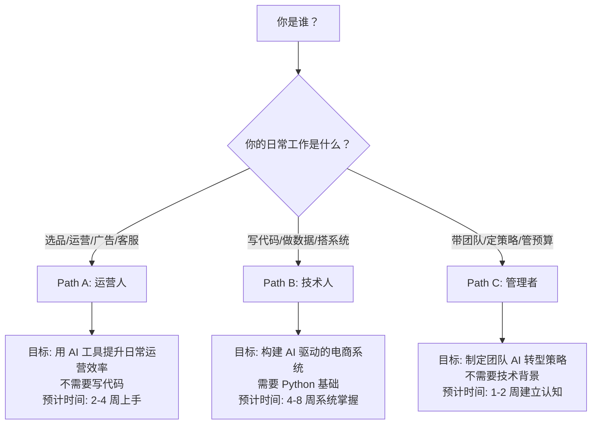
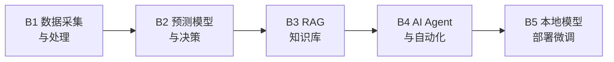

# CBEC-AI-Hub

Cross-Border E-Commerce AI Knowledge Hub | 跨境电商 AI 知识中心

**An AAAI China Chapter Initiative**

AI 正在重塑跨境电商的每一个环节。这个项目提供系统化的学习路径、可直接使用的工具模板和实战案例，帮助不同背景的电商从业者把 AI 真正用起来。

**不是链接聚合，而是原创实战内容。** 每个模块都包含：可直接复制的 Prompt 模板、可在 Google Colab 运行的 Notebook、来自一线操盘手的实战案例。

---

## 目录

- [选择你的路径](#选择你的路径)
- [5 分钟快速开始](#5-分钟快速开始)
- [Path A: 运营人 -- AI 提效实战](#path-a-运营人----ai-提效实战)
  - [A1. 选品与市场洞察](#a1-选品与市场洞察)
  - [A2. Listing 与内容创作](#a2-listing-与内容创作)
  - [A3. 广告优化](#a3-广告优化)
  - [A4. 客服与售后](#a4-客服与售后)
  - [A5. 库存与供应链](#a5-库存与供应链)
  - [A6. 合规与风控](#a6-合规与风控)
- [Path B: 技术人 -- AI 系统构建](#path-b-技术人----ai-系统构建)
  - [B1. 数据采集与处理自动化](#b1-数据采集与处理自动化)
  - [B2. 预测模型与智能决策](#b2-预测模型与智能决策)
  - [B3. RAG 知识库系统](#b3-rag-知识库系统)
  - [B4. AI Agent 与工作流自动化](#b4-ai-agent-与工作流自动化)
  - [B5. 本地模型部署与微调](#b5-本地模型部署与微调)
- [Path C: 管理者 -- AI 战略落地](#path-c-管理者----ai-战略落地)
  - [C1. AI 能力评估与规划](#c1-ai-能力评估与规划)
  - [C2. 团队 AI 技能建设](#c2-团队-ai-技能建设)
  - [C3. AI 项目 ROI 评估](#c3-ai-项目-roi-评估)
- [Prompt 模板库](#prompt-模板库)
- [Notebook 实验室](#notebook-实验室)
- [学习路径追踪](#学习路径追踪)
- [AAAI China Chapter 社群](#aaai-china-chapter-社群)
- [贡献指南](#贡献指南)

---

## 选择你的路径



| 路径 | 适合谁 | 需要写代码吗 | 时间投入 | 核心产出 |
|------|--------|-------------|----------|----------|
| **Path A: 运营人** | 选品/运营/广告/客服岗 | 不需要 | 每天30分钟，2-4周 | 一套可复用的 AI 工作流 |
| **Path B: 技术人** | 开发/数据/BI 岗 | 需要 Python | 每天1小时，4-8周 | 一个可部署的 AI 工具 |
| **Path C: 管理者** | 团队负责人/创始人 | 不需要 | 集中3-5小时 | 一份 AI 落地规划书 |

> 不确定选哪条？三条路径可以交叉学习。运营人学完 Path A 想深入，可以进 Path B；管理者想了解细节，可以看 Path A 的具体模块。

[回到目录](#目录)

---

## 5 分钟快速开始

不管你选哪条路径，先花 5 分钟完成这个练习，体验 AI 在电商场景中的威力。

打开 [ChatGPT](https://chat.openai.com/)（免费版即可）或 [Claude](https://claude.ai/)，复制粘贴以下 Prompt：

```
你是一个资深的跨境电商运营专家，精通 Amazon 平台。

我想在 Amazon US 销售一款便携式颈挂风扇（Neck Fan）。
请帮我做一个快速的市场可行性分析，包含：

1. 这个品类的市场特征（季节性、竞争程度、价格带）
2. TOP 3 竞品的核心卖点和差评中的主要痛点
3. 如果我要进入这个市场，3个可能的差异化方向
4. 风险提示（合规、专利、季节性库存风险）

请用表格形式呈现关键数据对比。
```

你会在 30 秒内得到一份初步的市场分析。这就是 AI 在电商中的基本用法 -- 把需要几小时的调研压缩到几分钟。

接下来的内容会教你如何把这种能力系统化地应用到运营的每一个环节。

[回到目录](#目录)

---

## Path A: 运营人 -- AI 提效实战

> 目标：不写一行代码，用 AI 工具把日常运营效率提升 3-10 倍
>
> 前提：你已经有基本的电商运营经验（知道什么是 ASIN、PPC、FBA）
>
> 时间：每天 30 分钟，2-4 周完成全部模块

### A1. 选品与市场洞察

**AI 能帮你做什么：** 把需要几天的选品调研压缩到几小时。批量分析竞品 Review 提取痛点，发现关键词背后的真实需求，快速评估市场可行性。

<details>
<summary>Prompt 模板（点击展开，可直接复制使用）</summary>

**竞品 Review 痛点分析**
```
你是一个资深的 Amazon 产品经理。我会给你一组竞品的 1-3 星差评。
请分析这些差评，输出：
1. 排名前5的用户痛点（按提及频率排序）
2. 每个痛点的具体描述和代表性评论原文
3. 针对每个痛点的产品改进建议
4. 这些痛点中，哪些最容易通过产品设计解决

输出格式：用表格呈现，列为：痛点 | 频率 | 代表性评论 | 改进建议 | 难度

[在此粘贴差评内容]
```

**市场可行性快速评估**
```
你是一个跨境电商选品专家。请对以下产品做市场可行性评估：

产品：[产品名称]
目标市场：Amazon [US/DE/JP]

请从以下维度分析，每个维度给出 1-5 分评分：
1. 市场需求（搜索量趋势、品类增长性）
2. 竞争强度（头部卖家集中度、新品进入难度）
3. 利润空间（典型售价、预估成本结构）
4. 供应链难度（供应商可得性、品控要求）
5. 合规风险（认证要求、专利风险）

最后给出综合建议：进入 / 谨慎 / 放弃，并说明理由。
```

**关键词需求聚类**
```
以下是一个 Amazon 品类的搜索关键词列表（来自 Helium 10 或 Jungle Scout）。
请将这些关键词按用户的真实购买意图进行聚类分组。

对每个聚类：
1. 给出聚类名称（代表的用户需求）
2. 包含的关键词列表
3. 预估的需求强度（高/中/低）
4. 对应的产品特性建议

[在此粘贴关键词列表]
```
</details>

**工具推荐：**

| 工具 | 免费 | 用途 |
|------|------|------|
| ChatGPT / Claude | 免费版可用 | Review 分析、市场评估、关键词聚类 |
| [Perplexity](https://www.perplexity.ai/) | 免费 | 带引用的市场调研（直接问"Amazon US neck fan market trend"） |
| [Google Trends](https://trends.google.com/) | 免费 | 验证品类搜索趋势和季节性 |
| Google Gemini | 免费 | 上传竞品截图做多模态分析 |

**学习资源：**

| 资源 | 说明 |
|------|------|
| [DeepLearning.AI: ChatGPT Prompt Engineering for Developers](https://www.deeplearning.ai/short-courses/chatgpt-prompt-engineering-for-developers/) | 免费，1.5小时，Prompt 工程入门 |
| [OpenAI Prompt Engineering Guide](https://platform.openai.com/docs/guides/prompt-engineering) | 免费，官方最佳实践 |

**完成标志：** [ ] 用 AI 完成一个完整的选品可行性分析报告

---

### A2. Listing 与内容创作

**AI 能帮你做什么：** 从零生成 Listing 初稿（标题、五点、描述、A+），多语言本地化翻译，生成产品场景图和广告素材。

<details>
<summary>Prompt 模板（点击展开）</summary>

**Listing 全套生成**
```
你是一个 Amazon Listing 优化专家，精通 [目标市场] 市场的搜索习惯。

产品信息：
- 产品名称：[名称]
- 核心卖点：[卖点1]、[卖点2]、[卖点3]
- 目标客户：[客户画像]
- 核心关键词：[关键词列表]

请生成：
1. 标题（不超过200字符，前80字符包含最重要的关键词）
2. 5个 Bullet Points（每条以大写卖点开头，融入关键词，突出差异化）
3. 产品描述（200字以内，讲品牌故事和使用场景）
4. 后台 Search Terms（5行，每行不超过250字节，不重复标题中的词）

要求：
- 关键词自然融入，不堆砌
- 语言符合 [目标市场] 消费者的搜索和阅读习惯
- 突出与竞品的差异化
```

**多语言本地化（不是直译）**
```
你是一个精通 [目标语言] 的 Amazon Listing 本地化专家。

以下是英文版 Listing：
[粘贴英文 Listing]

请翻译为 [目标语言] 版本。注意：
1. 不是逐字翻译，要符合 [目标市场] 消费者的搜索习惯和表达方式
2. 替换为当地市场常用的搜索关键词
3. 调整卖点顺序，把 [目标市场] 消费者最关心的放前面
4. 标注你做了哪些本地化调整及原因
```

**竞品 Listing 策略拆解**
```
分析以下 3 个竞品的 Amazon Listing，对比它们的策略差异：

[竞品A标题和五点]
[竞品B标题和五点]
[竞品C标题和五点]

请输出：
1. 三个竞品各自的核心定位（用一句话概括）
2. 它们共同强调的卖点（品类"必备项"）
3. 各自独有的卖点（差异化机会）
4. 关键词覆盖对比表
5. 我的 Listing 应该如何差异化定位
```
</details>

**工具推荐：**

| 工具 | 免费 | 用途 |
|------|------|------|
| ChatGPT / Claude | 免费版可用 | Listing 生成、竞品分析、多语言翻译 |
| [DeepL](https://www.deepl.com/) | 免费（有限额） | 高质量翻译，尤其欧洲语言 |
| [Canva AI](https://www.canva.com/) | 部分免费 | A+ Content 设计、产品图编辑 |
| [Leonardo.ai](https://leonardo.ai/) | 有免费额度 | AI 产品场景图生成 |

**完成标志：** [ ] 用 AI 生成一套完整的多语言 Listing（至少2种语言）

---

### A3. 广告优化

**AI 能帮你做什么：** 分析搜索词报告找出浪费和机会，批量生成否定关键词，生成广告文案变体做 A/B 测试。

<details>
<summary>Prompt 模板（点击展开）</summary>

**搜索词报告分析**
```
你是一个 Amazon PPC 广告优化专家。

以下是我的搜索词报告数据（过去30天）：
[粘贴：搜索词、展示量、点击量、花费、订单数、销售额]

请分析并输出：
1. 高转化关键词 TOP 10（按 ROAS 排序）-- 建议提高竞价
2. 高花费低转化关键词 TOP 10 -- 建议降低竞价或否定
3. 高展示低点击关键词（CTR < 0.3%）-- 分析可能原因
4. 建议添加的否定关键词列表（精确否定 vs 短语否定）
5. 预算重新分配建议

用表格呈现，标注每个关键词的建议操作和优先级。
```

**广告文案 A/B 测试**
```
我的产品是 [产品描述]，核心卖点是 [卖点]。

请为 Sponsored Brands 广告生成 5 个不同风格的 Headline（每个不超过50字符）：
1. 功能导向型
2. 场景导向型
3. 情感导向型
4. 数据导向型（如"24小时续航"）
5. 问题解决型（如"告别XX烦恼"）

每个 Headline 标注预期效果和适合的受众。
```
</details>

**学习资源：**

| 资源 | 说明 |
|------|------|
| [Amazon Advertising Learning Console](https://learningconsole.amazonadvertising.com/) | 免费，官方广告课程 |
| [Google: Fundamentals of Digital Marketing](https://learndigital.withgoogle.com/digitalgarage) | 免费认证，数字广告基础 |

**完成标志：** [ ] 用 AI 分析一份真实的搜索词报告并执行优化建议

---

### A4. 客服与售后

**AI 能帮你做什么：** 生成多语言客服回复模板，批量分析差评提取产品问题，辅助撰写账号申诉信。

<details>
<summary>Prompt 模板（点击展开）</summary>

**差评批量分析**
```
你是一个电商产品质量分析师。以下是我的产品最近60天的所有1-3星评论。

请完成：
1. 按问题类型分类（质量/功能/物流/使用困难/预期不符/其他）
2. 每个类型的频率和占比（用表格）
3. 每个类型中最有代表性的3条评论原文
4. 针对每个问题：
   - 短期应对（Listing 调整、客服话术）
   - 长期改善（产品改进、供应商沟通要点）
5. 优先级排序：先解决哪个问题（考虑频率 x 严重程度）

[粘贴差评内容]
```

**账号申诉信（Plan of Action）**
```
你是一个 Amazon 账号申诉专家。我的账号因为以下原因被暂停：
[粘贴违规通知]

请撰写 Plan of Action，包含：
1. Root Cause -- 承认问题，不推卸
2. Immediate Actions -- 已采取的紧急措施（要具体）
3. Preventive Measures -- 防止再次发生的长期措施（要可执行）

要求：语气诚恳专业，每个部分用编号列出具体行动项，不要空话。
```
</details>

**完成标志：** [ ] 建立一套多语言客服回复模板库（至少覆盖5个常见场景）

---

### A5. 库存与供应链

**AI 能帮你做什么：** 基于历史数据预测补货需求，计算安全库存和最优补货时间，分析 IPI 分数改善方案。

<details>
<summary>Prompt 模板（点击展开）</summary>

**补货决策分析**
```
我的产品数据：
- 过去90天日均销量：[X] 件（波动范围 [min]-[max]）
- 当前 FBA 库存：[X] 件
- 在途库存：[X] 件
- 从下单到入仓的 Lead Time：[X] 天
- 安全库存天数目标：[X] 天

请计算：
1. 当前库存可支撑天数
2. 最晚采购下单日期
3. 建议采购量（乐观/基准/悲观三种场景）
4. 如果有大促（如 Prime Day），需要额外备多少
5. 资金占用估算
```
</details>

**完成标志：** [ ] 用 AI 建立一个产品的补货决策模型

---

### A6. 合规与风控

**AI 能帮你做什么：** 快速查询不同国家/品类的合规要求，生成合规清单，评估政策变化的影响。

<details>
<summary>Prompt 模板（点击展开）</summary>

**多市场合规对比**
```
我要在 Amazon [US/DE/JP] 销售 [产品类型]。

请生成合规要求对比表：
1. 每个市场需要的产品认证
2. 包装和标签的特殊要求
3. 特殊品类的额外要求（如电池、儿童用品、食品接触）
4. 预估认证费用范围和周期
5. 常见合规陷阱

注意：法规可能已更新，请标注信息时效性，建议向认证机构确认。
```
</details>

**完成标志：** [ ] 为一个产品生成完整的多市场合规清单

---

**Path A 总完成标志：** 完成以上 6 个模块的所有 checklist 项，你已经建立了一套系统化的 AI 辅助运营工作流。

[回到目录](#目录)

---

## Path B: 技术人 -- AI 系统构建

> 目标：构建 AI 驱动的电商工具和系统，从脚本到产品级应用
>
> 前提：有 Python 基础（或愿意边学边做，AI 会帮你写代码）
>
> 时间：每天 1 小时，4-8 周系统掌握



### B1. 数据采集与处理自动化

**你将构建：** 自动化数据管道 -- 从 Amazon 报告到清洗后的分析数据集。

| 技术 | 开源/免费 | 用途 |
|------|-----------|------|
| [pandas](https://pandas.pydata.org/) | 开源 | 数据处理核心 |
| [openpyxl](https://openpyxl.readthedocs.io/) | 开源 | Excel 自动化 |
| [Playwright](https://playwright.dev/python/) | 开源 | 浏览器自动化（比 Selenium 更现代） |
| [Amazon SP-API](https://developer-docs.amazon.com/sp-api/) | 免费 | 官方数据 API |
| [DuckDB](https://duckdb.org/) | 开源 | 高性能本地数据查询 |

**Notebook：** `notebooks/b1-data-pipeline.ipynb` -- 从 Amazon 业务报告到自动化周报 *(即将发布)*

**学习资源：**

| 资源 | 说明 |
|------|------|
| [Kaggle: Pandas Course](https://www.kaggle.com/learn/pandas) | 免费，4小时，pandas 最快入门 |
| [Coursera: Python for Everybody](https://www.coursera.org/specializations/python) | 免费旁听，Python 零基础入门 |
| [Automate the Boring Stuff with Python](https://automatetheboringstuff.com/) | 免费在线书 |

**完成标志：** [ ] 写一个脚本自动合并多个 Amazon 报告并生成汇总

---

### B2. 预测模型与智能决策

**你将构建：** 销量预测模型 -- 基于历史数据预测未来需求，辅助补货决策。

| 技术 | 开源/免费 | 用途 |
|------|-----------|------|
| [Facebook Prophet](https://facebook.github.io/prophet/) | 开源 | 时间序列预测（最易上手） |
| [Darts](https://unit8co.github.io/darts/) | 开源 | 更多模型选择 |
| [AutoGluon](https://auto.gluon.ai/) | 开源 | 自动化 ML，零 ML 知识也能建模 |
| [BERTopic](https://maartengr.github.io/BERTopic/) | 开源 | Review 主题建模 |
| [OR-Tools](https://developers.google.com/optimization) | 开源 | 补货策略运筹优化 |

**Notebook：** `notebooks/b2-demand-forecast.ipynb` -- 用 Prophet 预测 SKU 销量 *(即将发布)*

**学习资源：**

| 资源 | 说明 |
|------|------|
| [Prophet 官方教程](https://facebook.github.io/prophet/docs/quick_start.html) | 免费，30分钟上手 |
| [Kaggle: Intro to Machine Learning](https://www.kaggle.com/learn/intro-to-machine-learning) | 免费，4小时 |
| [Google: Machine Learning Crash Course](https://developers.google.com/machine-learning/crash-course) | 免费，15小时 |

**完成标志：** [ ] 用 Prophet 对一个真实 SKU 做 90 天销量预测

---

### B3. RAG 知识库系统

**你将构建：** 基于内部文档的 AI 问答系统 -- 上传产品手册、政策文档、FAQ，AI 自动检索回答。

| 技术 | 开源/免费 | 用途 |
|------|-----------|------|
| [LlamaIndex](https://docs.llamaindex.ai/) | 开源 | RAG 框架（推荐入门） |
| [LangChain](https://python.langchain.com/) | 开源 | LLM 应用开发框架 |
| [Chroma](https://www.trychroma.com/) | 开源 | 轻量向量数据库 |
| [Ollama](https://ollama.com/) | 开源 | 本地运行 LLM |

**Notebook：** `notebooks/b3-rag-knowledge-base.ipynb` -- 构建产品 FAQ 知识库 *(即将发布)*

**学习资源：**

| 资源 | 说明 |
|------|------|
| [DeepLearning.AI: Building RAG Agents with LlamaIndex](https://www.deeplearning.ai/short-courses/building-agentic-rag-with-llamaindex/) | 免费短课 |
| [LlamaIndex 官方教程](https://docs.llamaindex.ai/en/stable/getting_started/) | 免费 |
| [HuggingFace NLP Course](https://huggingface.co/learn/nlp-course) | 免费 |

**完成标志：** [ ] 搭建一个可以回答产品相关问题的 RAG 系统

---

### B4. AI Agent 与工作流自动化

**你将构建：** AI Agent 系统 -- 自动执行多步骤运营任务（如每日数据检查 + 异常告警 + 报告生成）。

| 技术 | 开源/免费 | 用途 |
|------|-----------|------|
| [LangGraph](https://langchain-ai.github.io/langgraph/) | 开源 | Agent 工作流编排 |
| [CrewAI](https://docs.crewai.com/) | 开源 | 多 Agent 协作 |
| [n8n](https://n8n.io/) | 开源 | 可视化工作流自动化 |
| [Streamlit](https://streamlit.io/) | 开源 | 快速搭建 Web 界面 |

**Notebook：** `notebooks/b4-agent-workflow.ipynb` -- 构建运营日报自动生成 Agent *(即将发布)*

**学习资源：**

| 资源 | 说明 |
|------|------|
| [DeepLearning.AI: AI Agents in LangGraph](https://www.deeplearning.ai/short-courses/ai-agents-in-langgraph/) | 免费短课 |
| [DeepLearning.AI: Multi AI Agent Systems with crewAI](https://www.deeplearning.ai/short-courses/multi-ai-agent-systems-with-crewai/) | 免费短课 |
| [HuggingFace: AI Agents Course](https://huggingface.co/learn/agents-course) | 免费 |

**完成标志：** [ ] 部署一个自动化运营监控 Agent

---

### B5. 本地模型部署与微调

**你将构建：** 本地 AI 服务 -- 在自己的机器上运行 LLM，保护商业数据隐私；微调模型适配电商场景。

| 技术 | 开源/免费 | 用途 |
|------|-----------|------|
| [Ollama](https://ollama.com/) | 开源 | 一行命令运行本地 LLM |
| [vLLM](https://github.com/vllm-project/vllm) | 开源 | 高性能 LLM 推理 |
| [PEFT/LoRA](https://huggingface.co/docs/peft) | 开源 | 参数高效微调 |
| [Unsloth](https://github.com/unslothai/unsloth) | 开源 | 2x 快速微调 |

**学习资源：**

| 资源 | 说明 |
|------|------|
| [Ollama 官方文档](https://ollama.com/) | 免费，5分钟部署本地 LLM |
| [DeepLearning.AI: Finetuning Large Language Models](https://www.deeplearning.ai/short-courses/finetuning-large-language-models/) | 免费短课 |
| [Coursera: Generative AI for Everyone (Andrew Ng)](https://www.coursera.org/learn/generative-ai-for-everyone) | 免费旁听 |

**完成标志：** [ ] 用 Ollama 在本地运行一个 LLM 并完成一个电商任务

---

**Path B 总完成标志：** 完成 B1-B4 中至少 3 个模块，你已经具备构建 AI 电商工具的能力。B5 为进阶选修。

[回到目录](#目录)

---

## Path C: 管理者 -- AI 战略落地

> 目标：理解 AI 能为团队做什么，制定可执行的 AI 落地计划
>
> 前提：不需要技术背景，但需要对业务有深入理解
>
> 时间：集中 3-5 小时完成评估和规划

### C1. AI 能力评估与规划

**你需要回答的核心问题：** 我的团队在哪些环节可以用 AI？优先级是什么？

**AI 落地优先级矩阵：**

| 环节 | AI 提效潜力 | 实施难度 | 建议优先级 |
|------|------------|----------|-----------|
| Listing 文案生成 | 高（5-10x） | 低（不需要代码） | P0 立即开始 |
| 客服回复模板 | 高（3-5x） | 低 | P0 立即开始 |
| 竞品 Review 分析 | 高（10x+） | 低 | P0 立即开始 |
| 广告搜索词分析 | 中（2-3x） | 低 | P1 本月启动 |
| 多语言翻译 | 高（5x） | 低 | P1 本月启动 |
| 数据报表自动化 | 高（10x+） | 中（需要基础代码） | P2 本季度 |
| 销量预测 | 中（2-3x） | 中 | P2 本季度 |
| AI Agent 自动化 | 高（10x+） | 高（需要开发） | P3 下季度 |

<details>
<summary>Prompt 模板：生成你的团队 AI 落地规划</summary>

```
你是一个 AI 战略顾问，专注于电商行业的 AI 落地。

我的团队情况：
- 团队规模：[X] 人
- 主要业务：[Amazon/Shopify/多平台]，[X] 个品牌，[X] 个市场
- 团队构成：[运营X人、广告X人、客服X人、设计X人、技术X人]
- 当前痛点：[列出3-5个最耗时的重复性工作]
- 技术能力：[团队中有人会写代码吗？]
- 预算：[愿意投入的月度 AI 工具预算]

请输出：
1. AI 落地优先级排序（按 ROI 从高到低）
2. 每个优先项的具体实施方案（工具选择、实施步骤、时间线）
3. 预期效果（节省的时间/人力，用具体数字）
4. 风险和注意事项
5. 3个月、6个月、12个月的里程碑规划
```
</details>

**完成标志：** [ ] 完成团队 AI 能力评估，输出优先级排序

---

### C2. 团队 AI 技能建设

**如何让团队快速上手 AI：**

| 阶段 | 时间 | 目标 | 方法 |
|------|------|------|------|
| 第1周 | 2小时 | 全员体验 AI | 组织 workshop，每人用 ChatGPT 完成一个工作任务 |
| 第2-3周 | 每天15分钟 | 建立习惯 | 每天用 AI 辅助一个具体工作场景 |
| 第4周 | 2小时 | 沉淀方法 | 团队分享各自的 AI 使用心得，整理 Prompt 模板库 |
| 持续 | 每周30分钟 | 迭代优化 | 每周分享一个新的 AI 用法，更新团队 Prompt 库 |

**完成标志：** [ ] 团队至少 80% 的人每天在使用 AI 工具

---

### C3. AI 项目 ROI 评估

**如何衡量 AI 落地的效果：**

```
ROI 计算框架：

投入成本 = AI 工具订阅费 + 学习时间成本 + 实施时间成本
产出价值 = 节省的人力时间 x 时薪 + 质量提升带来的业务增长

示例：
- Listing AI 辅助生成：原来每个 Listing 4小时 → 现在1小时
  节省 3小时/Listing x 50元/小时 = 150元/Listing
  每月生成 20 个 Listing = 节省 3000元/月
  
- Review 分析自动化：原来每周8小时手动分析 → 现在30分钟
  节省 7.5小时/周 x 50元/小时 = 375元/周 = 1500元/月
```

**完成标志：** [ ] 完成至少一个 AI 项目的 ROI 评估报告

---

**Path C 总完成标志：** 输出一份完整的团队 AI 落地规划书（包含优先级、时间线、预算、KPI）。

[回到目录](#目录)

---

## Prompt 模板库

所有 Prompt 模板集中在 [`prompts/`](prompts/) 目录，按场景分类，可直接复制使用。

| 文件 | 场景 | 模板数量 |
|------|------|----------|
| `prompts/product-research.md` | 选品与市场分析 | *即将发布* |
| `prompts/listing-optimization.md` | Listing 生成与优化 | *即将发布* |
| `prompts/advertising.md` | 广告分析与优化 | *即将发布* |
| `prompts/customer-service.md` | 客服与售后 | *即将发布* |
| `prompts/compliance.md` | 合规与风控 | *即将发布* |
| `prompts/data-analysis.md` | 数据分析与报表 | *即将发布* |

每个模板都经过实际业务场景验证，标注了适用的 AI 工具和注意事项。

[回到目录](#目录)

---

## Notebook 实验室

可在 Google Colab 直接运行的 Jupyter Notebook，零配置上手。

| Notebook | 内容 | 难度 | Colab |
|----------|------|------|-------|
| `notebooks/b1-data-pipeline.ipynb` | Amazon 报告自动化处理 | 入门 | *即将发布* |
| `notebooks/b2-demand-forecast.ipynb` | Prophet 销量预测 | 中级 | *即将发布* |
| `notebooks/b2-review-analysis.ipynb` | BERTopic Review 主题分析 | 中级 | *即将发布* |
| `notebooks/b3-rag-knowledge-base.ipynb` | 产品 FAQ 知识库 | 中级 | *即将发布* |
| `notebooks/b4-agent-workflow.ipynb` | 运营日报自动生成 Agent | 高级 | *即将发布* |

[回到目录](#目录)

---

## 学习路径追踪

复制以下 checklist 到你的笔记工具中，追踪学习进度。

### Path A 进度追踪（运营人）

```
[ ] A1. 选品：用 AI 完成一个完整的选品可行性分析报告
[ ] A2. Listing：用 AI 生成一套完整的多语言 Listing
[ ] A3. 广告：用 AI 分析一份真实的搜索词报告并执行优化
[ ] A4. 客服：建立一套多语言客服回复模板库
[ ] A5. 库存：用 AI 建立一个产品的补货决策模型
[ ] A6. 合规：为一个产品生成完整的多市场合规清单
```

### Path B 进度追踪（技术人）

```
[ ] B1. 数据：写一个脚本自动合并多个 Amazon 报告
[ ] B2. 预测：用 Prophet 对一个真实 SKU 做 90 天销量预测
[ ] B3. RAG：搭建一个可以回答产品问题的 RAG 系统
[ ] B4. Agent：部署一个自动化运营监控 Agent
[ ] B5. 部署：用 Ollama 在本地运行 LLM（选修）
```

### Path C 进度追踪（管理者）

```
[ ] C1. 评估：完成团队 AI 能力评估和优先级排序
[ ] C2. 建设：团队 80%+ 的人每天使用 AI 工具
[ ] C3. ROI：完成至少一个 AI 项目的 ROI 评估报告
```

[回到目录](#目录)

---

## AAAI China Chapter 社群

CBEC-AI-Hub 是 **AAAI China Chapter (AAAI 中国分会)** 的开源项目之一。我们致力于推动 AI 技术在跨境电商领域的实际应用。

### 加入社群你能获得什么

- **月度 AI Workshop** -- 每月一次线上实战工作坊，跟着做一个完整的 AI 电商项目
- **Prompt 模板共创** -- 社群成员共同维护和优化 Prompt 模板库
- **案例分享** -- 一线操盘手分享 AI 在实际业务中的应用案例和踩坑经验
- **技术答疑** -- 遇到问题可以在社群中获得帮助
- **行业资讯** -- AI 工具更新、平台政策变化的第一手信息

### 如何参与

- Star 本仓库，关注更新
- [提交 Issue](https://github.com/kangise/CBEC-AI-Hub/issues) 反馈问题或建议
- [提交 PR](https://github.com/kangise/CBEC-AI-Hub/pulls) 贡献 Prompt 模板、Notebook 或案例
- 关注 AAAI China Chapter 获取活动信息

[回到目录](#目录)

---

## 贡献指南

我们特别欢迎以下类型的贡献：

1. **Prompt 模板** -- 你在实际工作中验证过的、效果好的 Prompt
2. **Notebook** -- 可在 Colab 运行的实战教程
3. **案例分享** -- 你用 AI 解决了什么电商问题？效果如何？
4. **工具评测** -- 你试过的 AI 工具，优缺点是什么？
5. **Bug 修复** -- 发现链接失效、内容过时？帮忙修正

贡献时请注意：
- 优先推荐免费或开源的工具和资源
- Prompt 模板需要标注你验证过的 AI 工具和效果
- Notebook 需要能在 Google Colab 免费版运行

详见 [CONTRIBUTING.md](CONTRIBUTING.md)。

---

## 许可证

[CC0 1.0](https://creativecommons.org/publicdomain/zero/1.0/) -- 自由使用，无需署名。

---

*An AAAI China Chapter Initiative | Maintained by the CBEC-AI community*
