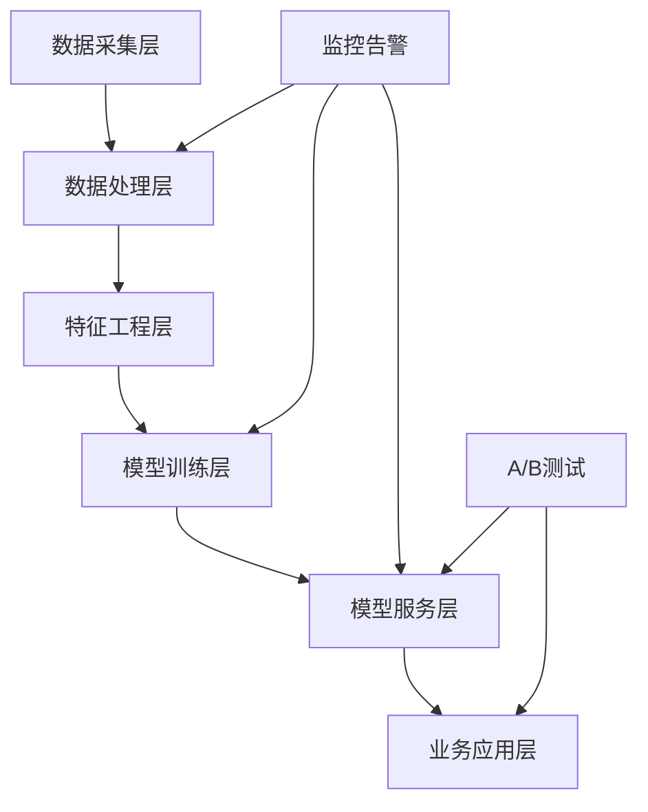

# 案例研究 | Case Studies

本目录包含CBEC-AI-Hub的实际应用案例研究，展示AI技术在跨境电商中的具体实现和效果。

## 📋 案例概览

<table width="100%">
<tr>
<th>案例</th>
<th>领域</th>
<th>技术栈</th>
<th>类型</th>
<th>状态</th>
</tr>
<tr>
<td><a href="#智能hs编码分类">智能HS编码分类</a></td>
<td>海关合规</td>
<td>BERT, FastAPI</td>
<td>技术方案示例</td>
<td>📖 示例</td>
</tr>
<tr>
<td><a href="#多语言产品推荐">多语言产品推荐</a></td>
<td>个性化营销</td>
<td>LightFM, spaCy</td>
<td>技术方案示例</td>
<td>📖 示例</td>
</tr>
<tr>
<td><a href="#供应链需求预测">供应链需求预测</a></td>
<td>库存优化</td>
<td>Prophet, Darts</td>
<td>技术方案示例</td>
<td>📋 待完善</td>
</tr>
<tr>
<td><a href="#跨境支付欺诈检测">跨境支付欺诈检测</a></td>
<td>风险控制</td>
<td>PyOD, XGBoost</td>
<td>技术方案示例</td>
<td>📋 待完善</td>
</tr>
</table>

> **重要说明**: 当前的案例研究主要是技术方案示例和最佳实践指南，旨在展示如何使用相关技术栈解决跨境电商AI问题。我们正在征集真实的项目案例，如果您有实际项目经验愿意分享，欢迎贡献！

## 🎯 详细案例

### 智能HS编码分类

**背景**: 某中型跨境电商企业每月处理10,000+新产品上架，手动HS编码分类耗时且易错。

**解决方案**:
- 使用多语言BERT模型进行产品描述理解
- 构建HS编码知识图谱
- 实现基于相似度的智能分类系统

**技术实现**:
```python
# 核心技术栈
- transformers (BERT多语言模型)
- scikit-learn (分类算法)
- FastAPI (API服务)
- Redis (缓存层)
```

**预期效果**:
- 目标分类准确率: 90%+
- 目标处理时间: < 5秒/产品
- 预期人工成本节省: 70%+

**详细文档**: [hs-code-classification.md](hs-code-classification.md)

> 📝 **注意**: 这是一个技术方案示例，展示了如何构建HS编码分类系统的完整流程。

---

### 多语言产品推荐

**背景**: 全球化电商平台需要为不同语言和文化背景的用户提供个性化推荐。

**解决方案**:
- 多语言嵌入向量统一表示
- 文化偏好建模
- 冷启动问题解决方案

**技术实现**:
```python
# 核心技术栈
- LightFM (推荐算法)
- spaCy (多语言NLP)
- Sentence-BERT (语义嵌入)
- MLflow (实验管理)
```

**业务成果**:
- 点击率提升: 28%
- 转化率提升: 32%
- 用户满意度: 4.6/5.0

**详细文档**: [multilingual-recommendation.md](multilingual-recommendation.md)

---

### 供应链需求预测

**背景**: 跨境电商面临长供应链周期，需要准确预测需求以优化库存。

**解决方案**:
- 多变量时间序列预测
- 外部因子整合（汇率、节假日、促销）
- 不确定性量化

**技术实现**:
```python
# 核心技术栈
- Prophet (时间序列预测)
- Darts (深度学习预测)
- Optuna (超参数优化)
- Streamlit (可视化界面)
```

**预期成果**:
- 预测准确率: MAPE < 15%
- 库存周转率提升: 20%
- 缺货率降低: 35%

**详细文档**: [supply-chain-forecasting.md](supply-chain-forecasting.md)

---

### 跨境支付欺诈检测

**背景**: 跨境支付面临复杂的欺诈风险，需要实时检测和防范。

**解决方案**:
- 异常检测算法组合
- 实时特征工程
- 可解释性AI

**技术实现**:
```python
# 核心技术栈
- PyOD (异常检测)
- XGBoost (梯度提升)
- SHAP (可解释性)
- Apache Kafka (实时流处理)
```

**预期成果**:
- 欺诈检测准确率: 98%+
- 误报率: < 2%
- 响应时间: < 100ms

**详细文档**: [fraud-detection.md](fraud-detection.md)

## 🛠️ 技术架构模式

### 通用架构组件



### 关键技术选型原则

1. **可扩展性**: 支持业务快速增长
2. **多语言支持**: 适应全球化需求
3. **实时性**: 满足业务实时决策需求
4. **可解释性**: 符合合规和审计要求
5. **成本效益**: 平衡性能与成本

## 📊 性能基准

### 模型性能指标

| 任务类型 | 准确率目标 | 延迟要求 | 吞吐量 |
|----------|------------|----------|--------|
| 文本分类 | > 90% | < 100ms | 1000 QPS |
| 推荐系统 | CTR > 3% | < 50ms | 5000 QPS |
| 时间序列预测 | MAPE < 20% | < 1s | 100 QPS |
| 异常检测 | F1 > 95% | < 10ms | 10000 QPS |

### 基础设施要求

- **计算资源**: 最小2核4GB，推荐8核16GB
- **存储**: SSD存储，最小100GB
- **网络**: 带宽最小100Mbps
- **容器化**: Docker + Kubernetes支持

## 🔄 持续改进

### 模型迭代流程

1. **数据收集**: 持续收集业务反馈数据
2. **性能监控**: 实时监控模型性能指标
3. **A/B测试**: 新模型与现有模型对比
4. **渐进部署**: 灰度发布降低风险
5. **效果评估**: 业务指标和技术指标双重评估

### 征集真实案例

我们正在征集真实的跨境电商AI项目案例！如果您有以下经验，欢迎分享：

**我们特别需要：**
- ✅ 真实的项目实施经验和完整的解决方案
- ✅ 具体的性能数据和业务指标
- ✅ 遇到的挑战和解决方案
- ✅ 技术选型的经验教训
- ✅ 部署和运维的实践经验

**案例研究提交流程：**
1. **[填写案例研究申请](https://github.com/kangise/CBEC-AI-Hub/issues/new?template=case_study_submission.md)** - 使用专用模板详细描述您的案例
2. **社区讨论** - 与维护者和社区讨论案例细节和技术方案
3. **完善文档** - 根据反馈完善案例研究内容
4. **提交PR** - 将完整的案例研究文档提交到`case-studies/`目录
5. **审核发布** - 经过审核后正式发布供社区学习

**贡献方式：**
- **[提交案例研究](https://github.com/kangise/CBEC-AI-Hub/issues/new?template=case_study_submission.md)** - 使用我们的专用模板
- **[参与讨论](https://github.com/kangise/CBEC-AI-Hub/discussions)** - 在社区中分享经验和想法
- **[联系维护者](https://github.com/kangise/CBEC-AI-Hub/issues)** - 进行深度案例访谈

**隐私保护：**
- 可以匿名化公司和产品信息
- 可以模糊化具体的业务数据
- 重点分享技术方案和经验

### 社区贡献

我们也欢迎其他形式的贡献：

- 提交新的应用场景
- 分享技术实现细节
- 贡献性能优化方案
- 报告问题和改进建议

## 📚 相关资源

- [技术博客](../blog/)
- [API文档](../docs/api/)
- [部署指南](../docs/deployment/)
- [最佳实践](../docs/best-practices/)

---

**案例研究贡献**: 如果您有新的案例研究想要分享，请使用我们的[案例研究提交模板](https://github.com/kangise/CBEC-AI-Hub/issues/new?template=case_study_submission.md)或参考[贡献指南](CONTRIBUTING.md)了解详细流程。