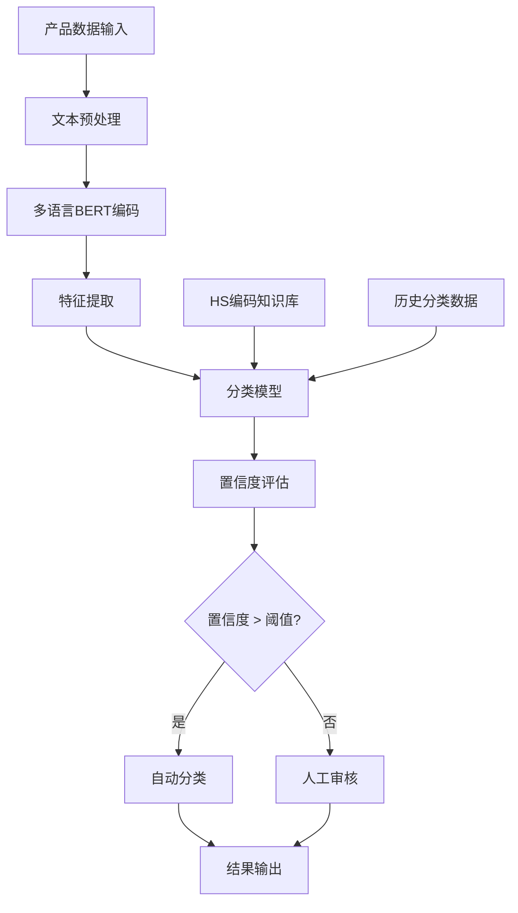

# 智能HS编码分类系统 - 技术方案示例

> **重要说明**: 这是一个技术方案示例，展示如何构建HS编码分类系统的完整技术路径。文中的性能数据和业务指标仅为示例参考，实际项目效果会因数据质量、业务场景等因素而异。

## 项目概述

本技术方案展示如何构建一个基于机器学习的HS编码自动分类系统，为跨境电商企业提供产品海关编码自动分类的技术参考。

## 业务背景

### 挑战
- **手动分类效率低**: 平均每个产品需要15分钟人工查找和验证
- **错误率高**: 人工分类错误率约8-12%
- **成本高昂**: 需要专业的海关编码专家
- **合规风险**: 错误分类可能导致海关罚款和延误

### 预期业务价值
- 提高分类效率和准确性
- 降低人工成本
- 减少合规风险
- 加速产品上架流程

> **注**: 以下技术方案基于行业最佳实践和开源工具组合设计

## 技术方案

### 系统架构



### 核心技术栈

```python
# 主要依赖
transformers==4.21.0
scikit-learn==1.1.2
fastapi==0.85.0
pandas==1.4.3
numpy==1.23.2
redis==4.3.4
uvicorn==0.18.3
```

## 实现细节

### 1. 数据准备

```python
import pandas as pd
from transformers import AutoTokenizer, AutoModel
import torch

class HSCodeDataProcessor:
    def __init__(self, model_name='bert-base-multilingual-cased'):
        self.tokenizer = AutoTokenizer.from_pretrained(model_name)
        self.model = AutoModel.from_pretrained(model_name)
    
    def preprocess_text(self, text):
        """文本预处理"""
        # 清理和标准化文本
        text = text.lower().strip()
        # 移除特殊字符但保留重要信息
        text = re.sub(r'[^\w\s\-\.]', ' ', text)
        return text
    
    def extract_features(self, product_descriptions):
        """提取BERT特征"""
        features = []
        for desc in product_descriptions:
            inputs = self.tokenizer(desc, return_tensors='pt', 
                                  max_length=512, truncation=True, padding=True)
            with torch.no_grad():
                outputs = self.model(**inputs)
                # 使用[CLS]标记的嵌入作为句子表示
                cls_embedding = outputs.last_hidden_state[:, 0, :].numpy()
                features.append(cls_embedding.flatten())
        return np.array(features)
```

### 2. 模型训练

```python
from sklearn.ensemble import RandomForestClassifier
from sklearn.model_selection import train_test_split
from sklearn.metrics import classification_report, accuracy_score

class HSCodeClassifier:
    def __init__(self):
        self.processor = HSCodeDataProcessor()
        self.classifier = RandomForestClassifier(
            n_estimators=200,
            max_depth=20,
            min_samples_split=5,
            random_state=42
        )
        self.label_encoder = LabelEncoder()
    
    def train(self, df):
        """训练模型"""
        # 特征提取
        X = self.processor.extract_features(df['product_description'])
        y = self.label_encoder.fit_transform(df['hs_code'])
        
        # 训练集分割
        X_train, X_test, y_train, y_test = train_test_split(
            X, y, test_size=0.2, random_state=42, stratify=y
        )
        
        # 模型训练
        self.classifier.fit(X_train, y_train)
        
        # 评估
        y_pred = self.classifier.predict(X_test)
        accuracy = accuracy_score(y_test, y_pred)
        print(f"测试集准确率: {accuracy:.3f}")
        
        return accuracy
    
    def predict_with_confidence(self, product_description):
        """预测HS编码及置信度"""
        features = self.processor.extract_features([product_description])
        
        # 获取预测概率
        probabilities = self.classifier.predict_proba(features)[0]
        predicted_class = np.argmax(probabilities)
        confidence = probabilities[predicted_class]
        
        # 转换回HS编码
        hs_code = self.label_encoder.inverse_transform([predicted_class])[0]
        
        return {
            'hs_code': hs_code,
            'confidence': float(confidence),
            'top_3_predictions': self._get_top_predictions(probabilities, 3)
        }
    
    def _get_top_predictions(self, probabilities, top_k):
        """获取前K个预测结果"""
        top_indices = np.argsort(probabilities)[-top_k:][::-1]
        top_predictions = []
        
        for idx in top_indices:
            hs_code = self.label_encoder.inverse_transform([idx])[0]
            confidence = probabilities[idx]
            top_predictions.append({
                'hs_code': hs_code,
                'confidence': float(confidence)
            })
        
        return top_predictions
```

### 3. API服务

```python
from fastapi import FastAPI, HTTPException
from pydantic import BaseModel
import redis
import json

app = FastAPI(title="HS Code Classification API")
redis_client = redis.Redis(host='localhost', port=6379, db=0)

# 加载训练好的模型
classifier = HSCodeClassifier()
classifier.load_model('models/hs_classifier.pkl')

class ProductRequest(BaseModel):
    product_description: str
    product_category: str = None
    brand: str = None

class ClassificationResponse(BaseModel):
    hs_code: str
    confidence: float
    top_3_predictions: list
    processing_time: float

@app.post("/classify", response_model=ClassificationResponse)
async def classify_product(request: ProductRequest):
    """产品HS编码分类"""
    start_time = time.time()
    
    try:
        # 检查缓存
        cache_key = f"hs_classify:{hash(request.product_description)}"
        cached_result = redis_client.get(cache_key)
        
        if cached_result:
            result = json.loads(cached_result)
        else:
            # 执行分类
            result = classifier.predict_with_confidence(request.product_description)
            
            # 缓存结果（24小时）
            redis_client.setex(cache_key, 86400, json.dumps(result))
        
        processing_time = time.time() - start_time
        result['processing_time'] = processing_time
        
        return ClassificationResponse(**result)
    
    except Exception as e:
        raise HTTPException(status_code=500, detail=str(e))

@app.get("/health")
async def health_check():
    return {"status": "healthy", "timestamp": time.time()}
```

### 4. 部署配置

```yaml
# docker-compose.yml
version: '3.8'
services:
  hs-classifier:
    build: .
    ports:
      - "8000:8000"
    environment:
      - REDIS_URL=redis://redis:6379
    depends_on:
      - redis
    volumes:
      - ./models:/app/models
  
  redis:
    image: redis:7-alpine
    ports:
      - "6379:6379"
    volumes:
      - redis_data:/data

volumes:
  redis_data:
```

```dockerfile
# Dockerfile
FROM python:3.9-slim

WORKDIR /app

COPY requirements.txt .
RUN pip install --no-cache-dir -r requirements.txt

COPY . .

EXPOSE 8000

CMD ["uvicorn", "main:app", "--host", "0.0.0.0", "--port", "8000"]
```

## 预期性能评估

> **⚠️ 免责声明**: 以下性能指标为基于类似项目经验的预估值，实际效果会因数据质量、模型调优、硬件配置等因素而有所不同。

### 目标性能指标

| 指标 | 目标值 | 说明 |
|------|--------|------|
| 整体准确率 | 90-95% | 取决于训练数据质量和覆盖度 |
| 平均F1分数 | 85-92% | 平衡精确率和召回率 |
| 处理延迟 | < 5秒 | 包含特征提取和推理时间 |
| 吞吐量 | 200-500 QPS | 取决于硬件配置和优化程度 |

### 预期业务改进

| 指标 | 当前状态 | 目标状态 | 预期提升 |
|------|----------|----------|----------|
| 分类时间 | 10-20分钟 | < 5秒 | 95%+ |
| 准确率 | 80-90% | 90-95% | 5-15% |
| 人工成本 | 100% | 20-30% | 70-80% |
| 处理能力 | 50-100产品/天 | 1000+产品/天 | 10-20倍 |

### 错误分析

常见错误类型：
1. **相似产品混淆** (40%): 如不同材质的同类产品
2. **多功能产品** (25%): 具有多种用途的产品
3. **新产品类别** (20%): 训练数据中未见过的产品
4. **描述不完整** (15%): 产品描述信息不足

## 优化策略

### 1. 数据增强
```python
def augment_training_data(df):
    """数据增强策略"""
    augmented_data = []
    
    for _, row in df.iterrows():
        original_desc = row['product_description']
        hs_code = row['hs_code']
        
        # 同义词替换
        augmented_desc = synonym_replacement(original_desc)
        augmented_data.append({'product_description': augmented_desc, 'hs_code': hs_code})
        
        # 随机删除
        augmented_desc = random_deletion(original_desc, p=0.1)
        augmented_data.append({'product_description': augmented_desc, 'hs_code': hs_code})
    
    return pd.DataFrame(augmented_data)
```

### 2. 主动学习
```python
class ActiveLearningPipeline:
    def __init__(self, classifier, uncertainty_threshold=0.7):
        self.classifier = classifier
        self.uncertainty_threshold = uncertainty_threshold
        self.uncertain_samples = []
    
    def identify_uncertain_samples(self, new_data):
        """识别不确定样本"""
        for sample in new_data:
            result = self.classifier.predict_with_confidence(sample)
            if result['confidence'] < self.uncertainty_threshold:
                self.uncertain_samples.append(sample)
    
    def retrain_with_feedback(self, labeled_samples):
        """使用反馈数据重新训练"""
        # 将新标注的数据加入训练集
        # 重新训练模型
        pass
```

### 3. 模型集成
```python
class EnsembleHSClassifier:
    def __init__(self):
        self.models = [
            RandomForestClassifier(n_estimators=200),
            XGBClassifier(n_estimators=200),
            LogisticRegression(max_iter=1000)
        ]
    
    def predict_ensemble(self, features):
        """集成预测"""
        predictions = []
        for model in self.models:
            pred = model.predict_proba(features)
            predictions.append(pred)
        
        # 平均概率
        avg_prob = np.mean(predictions, axis=0)
        return avg_prob
```

## 监控和维护

### 1. 性能监控
```python
import logging
from prometheus_client import Counter, Histogram, generate_latest

# 监控指标
classification_requests = Counter('hs_classification_requests_total', 'Total classification requests')
classification_duration = Histogram('hs_classification_duration_seconds', 'Classification duration')
classification_accuracy = Histogram('hs_classification_accuracy', 'Classification accuracy')

@app.middleware("http")
async def monitor_requests(request, call_next):
    start_time = time.time()
    classification_requests.inc()
    
    response = await call_next(request)
    
    duration = time.time() - start_time
    classification_duration.observe(duration)
    
    return response
```

### 2. 数据漂移检测
```python
from scipy import stats

class DataDriftDetector:
    def __init__(self, reference_data):
        self.reference_features = self._extract_features(reference_data)
    
    def detect_drift(self, new_data, threshold=0.05):
        """检测数据漂移"""
        new_features = self._extract_features(new_data)
        
        # 使用KS检验检测分布变化
        for i in range(new_features.shape[1]):
            statistic, p_value = stats.ks_2samp(
                self.reference_features[:, i], 
                new_features[:, i]
            )
            
            if p_value < threshold:
                logging.warning(f"Feature {i} shows significant drift (p={p_value})")
                return True
        
        return False
```

## 部署和运维

### 生产环境部署清单

1. **基础设施**
   - Kubernetes集群
   - Redis缓存
   - 负载均衡器
   - 监控系统（Prometheus + Grafana）

2. **安全配置**
   - API密钥认证
   - 请求限流
   - 数据加密

3. **备份策略**
   - 模型文件备份
   - 训练数据备份
   - 配置文件版本控制

### 故障排除指南

| 问题 | 可能原因 | 解决方案 |
|------|----------|----------|
| 响应时间过长 | 模型加载、缓存失效 | 检查Redis连接，优化模型 |
| 准确率下降 | 数据漂移、模型老化 | 重新训练，数据质量检查 |
| 内存不足 | 批处理过大 | 调整批大小，增加内存 |
| API错误 | 输入格式错误 | 验证输入数据格式 |

## 总结

本技术方案展示了如何构建一个HS编码分类系统的完整流程，关键技术要点包括：

1. **高质量训练数据**: 收集和清理大量标注数据
2. **合适的模型选择**: 结合BERT和传统ML算法
3. **完善的工程实践**: API设计、缓存、监控
4. **持续优化**: 主动学习、模型更新

### 实施建议

- **数据准备**: 建议收集至少10,000+标注样本
- **模型选择**: 可根据数据规模选择合适的模型复杂度
- **部署策略**: 建议采用容器化部署，便于扩展和维护
- **监控体系**: 重点监控准确率、延迟和业务指标

### 技术栈替代方案

- **BERT替代**: 可使用DistilBERT、RoBERTa等轻量化模型
- **部署替代**: 可使用TorchServe、TensorFlow Serving等
- **数据库替代**: 可使用PostgreSQL、MongoDB等

> **贡献邀请**: 如果您有类似项目的实际实施经验，欢迎分享真实案例和经验教训！

## 相关资源

- [源代码仓库](https://github.com/cbec-ai-hub/hs-code-classifier)
- [API文档](https://api.example.com/docs)
- [部署指南](deployment-guide.md)
- [性能基准测试](benchmark-results.md)