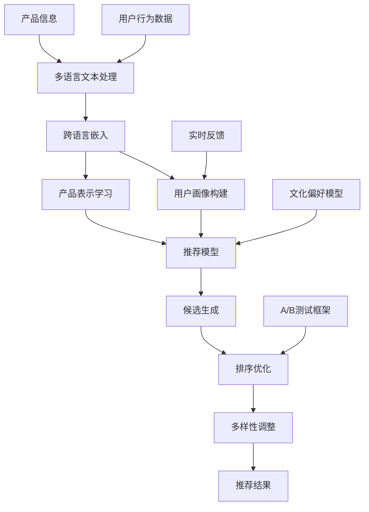

# 多语言产品推荐系统 - 技术方案示例

> **重要说明**: 这是一个技术方案示例，展示如何构建多语言推荐系统的完整技术架构。文中的性能数据和业务指标仅为示例参考，实际项目效果会因数据分布、用户行为等因素而异。

## 项目概述

本技术方案展示如何构建一个支持多语言和跨文化的产品推荐系统，为全球化电商平台提供个性化推荐服务的技术参考。

## 业务背景

### 挑战
- **语言障碍**: 用户使用不同语言搜索和浏览产品
- **文化差异**: 不同地区用户的购买偏好和行为模式差异巨大
- **冷启动问题**: 新用户和新产品缺乏历史数据
- **数据稀疏性**: 跨语言和跨地区的交互数据稀疏

### 预期业务目标
- 提高用户参与度和转化率
- 增强用户体验和满意度
- 扩大产品覆盖范围
- 支持业务全球化扩张

> **注**: 以下技术方案基于推荐系统领域的最佳实践设计

## 技术方案

### 系统架构



### 核心技术栈

```python
# 主要依赖
lightfm==1.16
spacy==3.4.1
sentence-transformers==2.2.2
scikit-learn==1.1.2
pandas==1.4.3
numpy==1.23.2
mlflow==1.28.0
fastapi==0.85.0
redis==4.3.4
```

## 实现细节

### 1. 多语言文本处理

```python
import spacy
from sentence_transformers import SentenceTransformer
import numpy as np

class MultilingualTextProcessor:
    def __init__(self):
        # 加载多语言模型
        self.nlp_models = {
            'en': spacy.load('en_core_web_sm'),
            'zh': spacy.load('zh_core_web_sm'),
            'es': spacy.load('es_core_news_sm'),
            'fr': spacy.load('fr_core_news_sm'),
            'de': spacy.load('de_core_news_sm'),
            'ja': spacy.load('ja_core_news_sm')
        }
        
        # 多语言句子嵌入模型
        self.sentence_model = SentenceTransformer('paraphrase-multilingual-MiniLM-L12-v2')
    
    def detect_language(self, text):
        """语言检测"""
        from langdetect import detect
        try:
            return detect(text)
        except:
            return 'en'  # 默认英语
    
    def preprocess_text(self, text, language=None):
        """文本预处理"""
        if language is None:
            language = self.detect_language(text)
        
        if language not in self.nlp_models:
            language = 'en'
        
        nlp = self.nlp_models[language]
        doc = nlp(text)
        
        # 提取关键词和实体
        keywords = [token.lemma_.lower() for token in doc 
                   if not token.is_stop and not token.is_punct and token.is_alpha]
        entities = [(ent.text, ent.label_) for ent in doc.ents]
        
        return {
            'keywords': keywords,
            'entities': entities,
            'language': language,
            'processed_text': ' '.join(keywords)
        }
    
    def get_text_embedding(self, text):
        """获取文本嵌入向量"""
        return self.sentence_model.encode([text])[0]
    
    def compute_text_similarity(self, text1, text2):
        """计算文本相似度"""
        emb1 = self.get_text_embedding(text1)
        emb2 = self.get_text_embedding(text2)
        return np.dot(emb1, emb2) / (np.linalg.norm(emb1) * np.linalg.norm(emb2))
```

### 2. 跨文化用户建模

```python
from lightfm import LightFM
from lightfm.data import Dataset
import pandas as pd

class CrossCulturalUserModel:
    def __init__(self):
        self.text_processor = MultilingualTextProcessor()
        self.cultural_features = {
            'US': {'individualism': 0.91, 'uncertainty_avoidance': 0.46, 'power_distance': 0.40},
            'CN': {'individualism': 0.20, 'uncertainty_avoidance': 0.30, 'power_distance': 0.80},
            'DE': {'individualism': 0.67, 'uncertainty_avoidance': 0.65, 'power_distance': 0.35},
            'JP': {'individualism': 0.46, 'uncertainty_avoidance': 0.92, 'power_distance': 0.54},
            'BR': {'individualism': 0.38, 'uncertainty_avoidance': 0.76, 'power_distance': 0.69}
        }
    
    def build_user_features(self, user_data):
        """构建用户特征"""
        features = []
        
        for _, user in user_data.iterrows():
            user_features = []
            
            # 基础特征
            user_features.extend([
                f"age_group:{self._get_age_group(user['age'])}",
                f"gender:{user['gender']}",
                f"country:{user['country']}",
                f"language:{user['preferred_language']}"
            ])
            
            # 文化维度特征
            if user['country'] in self.cultural_features:
                cultural = self.cultural_features[user['country']]
                for dim, value in cultural.items():
                    user_features.append(f"cultural_{dim}:{self._discretize(value)}")
            
            # 行为特征
            user_features.extend([
                f"avg_order_value:{self._discretize_price(user['avg_order_value'])}",
                f"purchase_frequency:{self._get_frequency_group(user['purchase_frequency'])}",
                f"preferred_categories:{','.join(user['preferred_categories'])}"
            ])
            
            features.append(user_features)
        
        return features
    
    def build_item_features(self, product_data):
        """构建产品特征"""
        features = []
        
        for _, product in product_data.iterrows():
            item_features = []
            
            # 基础特征
            item_features.extend([
                f"category:{product['category']}",
                f"brand:{product['brand']}",
                f"price_range:{self._discretize_price(product['price'])}",
                f"rating_range:{self._discretize_rating(product['avg_rating'])}"
            ])
            
            # 文本特征
            text_info = self.text_processor.preprocess_text(
                product['title'] + ' ' + product['description']
            )
            
            # 添加关键词特征
            for keyword in text_info['keywords'][:10]:  # 取前10个关键词
                item_features.append(f"keyword:{keyword}")
            
            # 添加语言特征
            item_features.append(f"content_language:{text_info['language']}")
            
            # 地区适应性特征
            if 'target_regions' in product:
                for region in product['target_regions']:
                    item_features.append(f"target_region:{region}")
            
            features.append(item_features)
        
        return features
    
    def _get_age_group(self, age):
        if age < 25: return "young"
        elif age < 35: return "adult"
        elif age < 50: return "middle_aged"
        else: return "senior"
    
    def _discretize(self, value, bins=5):
        return int(value * bins)
    
    def _discretize_price(self, price):
        if price < 20: return "low"
        elif price < 100: return "medium"
        elif price < 500: return "high"
        else: return "premium"
    
    def _discretize_rating(self, rating):
        if rating < 3.0: return "low"
        elif rating < 4.0: return "medium"
        else: return "high"
    
    def _get_frequency_group(self, frequency):
        if frequency < 2: return "occasional"
        elif frequency < 5: return "regular"
        else: return "frequent"
```

### 3. 推荐模型训练

```python
class MultilingualRecommendationModel:
    def __init__(self, no_components=100, loss='warp', learning_rate=0.05):
        self.model = LightFM(
            no_components=no_components,
            loss=loss,
            learning_rate=learning_rate,
            random_state=42
        )
        self.dataset = Dataset()
        self.user_model = CrossCulturalUserModel()
        self.is_fitted = False
    
    def prepare_data(self, interactions_df, users_df, items_df):
        """准备训练数据"""
        # 构建用户和物品特征
        user_features = self.user_model.build_user_features(users_df)
        item_features = self.user_model.build_item_features(items_df)
        
        # 创建数据集
        self.dataset.fit(
            users=interactions_df['user_id'].unique(),
            items=interactions_df['item_id'].unique(),
            user_features=set(feature for features in user_features for feature in features),
            item_features=set(feature for features in item_features for feature in features)
        )
        
        # 构建交互矩阵
        (interactions, weights) = self.dataset.build_interactions(
            [(row['user_id'], row['item_id'], row['rating']) 
             for _, row in interactions_df.iterrows()]
        )
        
        # 构建特征矩阵
        user_features_matrix = self.dataset.build_user_features(
            [(users_df.iloc[i]['user_id'], user_features[i]) 
             for i in range(len(users_df))]
        )
        
        item_features_matrix = self.dataset.build_item_features(
            [(items_df.iloc[i]['item_id'], item_features[i]) 
             for i in range(len(items_df))]
        )
        
        return interactions, user_features_matrix, item_features_matrix
    
    def train(self, interactions_df, users_df, items_df, epochs=50):
        """训练模型"""
        interactions, user_features, item_features = self.prepare_data(
            interactions_df, users_df, items_df
        )
        
        # 训练模型
        self.model.fit(
            interactions,
            user_features=user_features,
            item_features=item_features,
            epochs=epochs,
            verbose=True
        )
        
        self.is_fitted = True
        return self
    
    def predict(self, user_id, item_ids, user_features=None, item_features=None):
        """预测用户对物品的偏好分数"""
        if not self.is_fitted:
            raise ValueError("Model must be trained before making predictions")
        
        user_internal_id = self.dataset.mapping()[0][user_id]
        item_internal_ids = [self.dataset.mapping()[2][item_id] for item_id in item_ids]
        
        scores = self.model.predict(
            user_internal_id,
            item_internal_ids,
            user_features=user_features,
            item_features=item_features
        )
        
        return scores
    
    def recommend(self, user_id, n_items=10, filter_seen=True):
        """为用户推荐物品"""
        if not self.is_fitted:
            raise ValueError("Model must be trained before making recommendations")
        
        user_internal_id = self.dataset.mapping()[0][user_id]
        n_items_total = len(self.dataset.mapping()[2])
        
        scores = self.model.predict(
            user_internal_id,
            np.arange(n_items_total)
        )
        
        # 获取top-N推荐
        top_items = np.argsort(-scores)[:n_items]
        
        # 转换回原始ID
        item_mapping = {v: k for k, v in self.dataset.mapping()[2].items()}
        recommended_items = [item_mapping[item] for item in top_items]
        recommended_scores = scores[top_items]
        
        return list(zip(recommended_items, recommended_scores))
```

### 4. 实时推荐服务

```python
from fastapi import FastAPI, HTTPException
from pydantic import BaseModel
import redis
import json
import time

app = FastAPI(title="Multilingual Recommendation API")
redis_client = redis.Redis(host='localhost', port=6379, db=0)

# 加载训练好的模型
recommendation_model = MultilingualRecommendationModel()
recommendation_model.load_model('models/multilingual_recommender.pkl')

class RecommendationRequest(BaseModel):
    user_id: str
    language: str = 'en'
    country: str = 'US'
    n_items: int = 10
    category_filter: list = None

class RecommendationResponse(BaseModel):
    user_id: str
    recommendations: list
    language: str
    processing_time: float
    model_version: str

@app.post("/recommend", response_model=RecommendationResponse)
async def get_recommendations(request: RecommendationRequest):
    """获取个性化推荐"""
    start_time = time.time()
    
    try:
        # 检查缓存
        cache_key = f"rec:{request.user_id}:{request.language}:{request.country}"
        cached_result = redis_client.get(cache_key)
        
        if cached_result:
            recommendations = json.loads(cached_result)
        else:
            # 生成推荐
            raw_recommendations = recommendation_model.recommend(
                request.user_id, 
                n_items=request.n_items * 2  # 生成更多候选，后续过滤
            )
            
            # 应用过滤和多样性调整
            recommendations = await apply_filters_and_diversity(
                raw_recommendations, 
                request
            )
            
            # 缓存结果（1小时）
            redis_client.setex(cache_key, 3600, json.dumps(recommendations))
        
        processing_time = time.time() - start_time
        
        return RecommendationResponse(
            user_id=request.user_id,
            recommendations=recommendations[:request.n_items],
            language=request.language,
            processing_time=processing_time,
            model_version="v1.2.0"
        )
    
    except Exception as e:
        raise HTTPException(status_code=500, detail=str(e))

async def apply_filters_and_diversity(recommendations, request):
    """应用过滤器和多样性调整"""
    filtered_recs = []
    categories_seen = set()
    
    for item_id, score in recommendations:
        # 获取物品信息
        item_info = await get_item_info(item_id)
        
        # 类别过滤
        if request.category_filter and item_info['category'] not in request.category_filter:
            continue
        
        # 多样性控制：限制同一类别的物品数量
        if item_info['category'] in categories_seen and len([r for r in filtered_recs if r['category'] == item_info['category']]) >= 2:
            continue
        
        categories_seen.add(item_info['category'])
        
        # 本地化调整
        localized_info = await localize_item_info(item_info, request.language, request.country)
        
        filtered_recs.append({
            'item_id': item_id,
            'score': float(score),
            'title': localized_info['title'],
            'description': localized_info['description'],
            'price': localized_info['price'],
            'currency': localized_info['currency'],
            'category': item_info['category'],
            'image_url': item_info['image_url'],
            'rating': item_info['rating'],
            'availability': localized_info['availability']
        })
    
    return filtered_recs

async def get_item_info(item_id):
    """获取物品信息"""
    # 从数据库或缓存获取物品信息
    cache_key = f"item:{item_id}"
    cached_info = redis_client.get(cache_key)
    
    if cached_info:
        return json.loads(cached_info)
    
    # 从数据库查询（这里简化处理）
    item_info = {
        'item_id': item_id,
        'title': 'Sample Product',
        'description': 'Sample Description',
        'category': 'Electronics',
        'price': 99.99,
        'currency': 'USD',
        'rating': 4.5,
        'image_url': 'https://example.com/image.jpg'
    }
    
    # 缓存物品信息
    redis_client.setex(cache_key, 7200, json.dumps(item_info))
    
    return item_info

async def localize_item_info(item_info, language, country):
    """本地化物品信息"""
    localized_info = item_info.copy()
    
    # 价格本地化
    if country != 'US':
        localized_info['price'] = await convert_currency(item_info['price'], 'USD', get_currency(country))
        localized_info['currency'] = get_currency(country)
    
    # 文本本地化（这里简化，实际应该调用翻译服务）
    if language != 'en':
        localized_info['title'] = await translate_text(item_info['title'], 'en', language)
        localized_info['description'] = await translate_text(item_info['description'], 'en', language)
    
    # 可用性检查
    localized_info['availability'] = await check_availability(item_info['item_id'], country)
    
    return localized_info

def get_currency(country):
    """获取国家对应的货币"""
    currency_map = {
        'US': 'USD', 'CN': 'CNY', 'DE': 'EUR', 
        'JP': 'JPY', 'GB': 'GBP', 'BR': 'BRL'
    }
    return currency_map.get(country, 'USD')

async def convert_currency(amount, from_currency, to_currency):
    """货币转换（简化实现）"""
    # 实际应该调用汇率API
    rates = {'USD': 1.0, 'CNY': 6.8, 'EUR': 0.85, 'JPY': 110, 'GBP': 0.75, 'BRL': 5.2}
    return amount * rates.get(to_currency, 1.0) / rates.get(from_currency, 1.0)

async def translate_text(text, from_lang, to_lang):
    """文本翻译（简化实现）"""
    # 实际应该调用翻译API
    return f"[{to_lang}] {text}"

async def check_availability(item_id, country):
    """检查商品在指定国家的可用性"""
    # 实际应该检查库存和配送政策
    return True

@app.get("/health")
async def health_check():
    return {"status": "healthy", "timestamp": time.time()}
```

## 预期性能评估

> **⚠️ 免责声明**: 以下性能指标为基于推荐系统研究和行业经验的预估值，实际效果会因数据质量、用户行为模式、业务场景等因素而有显著差异。

### 目标离线评估指标

| 指标 | 目标范围 | 说明 |
|------|----------|------|
| Precision@10 | 0.10-0.20 | 取决于数据稀疏度和模型复杂度 |
| Recall@10 | 0.05-0.15 | 受限于候选集大小和用户兴趣广度 |
| NDCG@10 | 0.15-0.30 | 考虑排序质量的综合指标 |
| Coverage | 0.60-0.80 | 推荐系统覆盖的商品比例 |
| Diversity | 0.70-0.85 | 推荐结果的多样性程度 |

### 预期在线效果

| 指标 | 基准值 | 目标提升 | 说明 |
|------|--------|----------|------|
| 点击率 (CTR) | 基准 | +15-30% | 取决于基准系统质量 |
| 转化率 | 基准 | +10-25% | 受产品质量和价格影响 |
| 平均订单价值 | 基准 | +5-15% | 通过交叉销售实现 |
| 用户满意度 | 基准 | +0.2-0.5分 | 需要用户调研验证 |
| 页面停留时间 | 基准 | +20-40% | 反映用户参与度 |

### 多语言性能预期

| 语言 | 数据充足度 | 预期Precision@10 | 挑战 |
|------|------------|------------------|------|
| 英语 | 高 | 0.15-0.20 | 竞争激烈，用户期望高 |
| 中文 | 高 | 0.12-0.18 | 文化差异，地域偏好 |
| 西班牙语 | 中 | 0.10-0.15 | 地区差异大 |
| 法语 | 中 | 0.08-0.14 | 数据相对稀疏 |
| 德语 | 中 | 0.08-0.14 | 用户行为保守 |
| 日语 | 低 | 0.06-0.12 | 文化特殊性强 |

## 优化策略

### 1. 冷启动问题解决

```python
class ColdStartHandler:
    def __init__(self, recommendation_model):
        self.model = recommendation_model
        self.popularity_model = PopularityBasedRecommender()
        self.content_model = ContentBasedRecommender()
    
    def handle_new_user(self, user_profile):
        """处理新用户冷启动"""
        # 基于人口统计学特征的推荐
        demographic_recs = self.get_demographic_recommendations(user_profile)
        
        # 基于地理位置的流行商品推荐
        popular_recs = self.popularity_model.recommend_by_region(
            user_profile['country'], 
            user_profile['language']
        )
        
        # 混合推荐
        return self.blend_recommendations([demographic_recs, popular_recs], [0.6, 0.4])
    
    def handle_new_item(self, item_info):
        """处理新商品冷启动"""
        # 基于内容的相似商品推荐
        similar_items = self.content_model.find_similar_items(item_info)
        
        # 基于类别的推荐策略
        category_strategy = self.get_category_strategy(item_info['category'])
        
        return {
            'similar_items': similar_items,
            'promotion_strategy': category_strategy
        }
```

### 2. 实时个性化

```python
class RealTimePersonalization:
    def __init__(self):
        self.session_tracker = SessionTracker()
        self.real_time_updater = RealTimeModelUpdater()
    
    def update_recommendations(self, user_id, interaction_data):
        """基于实时交互更新推荐"""
        # 更新用户会话状态
        session_state = self.session_tracker.update_session(user_id, interaction_data)
        
        # 实时调整推荐权重
        adjusted_weights = self.calculate_dynamic_weights(session_state)
        
        # 重新排序推荐结果
        return self.rerank_recommendations(user_id, adjusted_weights)
    
    def calculate_dynamic_weights(self, session_state):
        """计算动态权重"""
        weights = {
            'popularity': 0.3,
            'collaborative': 0.4,
            'content': 0.2,
            'trending': 0.1
        }
        
        # 根据会话行为调整权重
        if session_state['browse_time'] > 300:  # 长时间浏览
            weights['content'] += 0.1
            weights['popularity'] -= 0.1
        
        if session_state['category_focus']:  # 专注特定类别
            weights['content'] += 0.15
            weights['collaborative'] -= 0.15
        
        return weights
```

### 3. 多目标优化

```python
class MultiObjectiveOptimizer:
    def __init__(self):
        self.objectives = {
            'relevance': 0.4,
            'diversity': 0.2,
            'novelty': 0.15,
            'business_value': 0.25
        }
    
    def optimize_recommendations(self, candidate_items, user_profile):
        """多目标优化推荐结果"""
        scores = {}
        
        for item in candidate_items:
            scores[item['item_id']] = {
                'relevance': self.calculate_relevance_score(item, user_profile),
                'diversity': self.calculate_diversity_score(item, candidate_items),
                'novelty': self.calculate_novelty_score(item, user_profile),
                'business_value': self.calculate_business_value(item)
            }
        
        # 计算综合分数
        final_scores = {}
        for item_id, item_scores in scores.items():
            final_score = sum(
                item_scores[obj] * weight 
                for obj, weight in self.objectives.items()
            )
            final_scores[item_id] = final_score
        
        # 排序并返回
        sorted_items = sorted(
            candidate_items, 
            key=lambda x: final_scores[x['item_id']], 
            reverse=True
        )
        
        return sorted_items
```

## 部署和监控

### 生产环境架构

```yaml
# kubernetes-deployment.yml
apiVersion: apps/v1
kind: Deployment
metadata:
  name: multilingual-recommender
spec:
  replicas: 3
  selector:
    matchLabels:
      app: multilingual-recommender
  template:
    metadata:
      labels:
        app: multilingual-recommender
    spec:
      containers:
      - name: recommender-api
        image: cbec-ai/multilingual-recommender:v1.2.0
        ports:
        - containerPort: 8000
        env:
        - name: REDIS_URL
          value: "redis://redis-service:6379"
        - name: MODEL_PATH
          value: "/models/multilingual_recommender.pkl"
        resources:
          requests:
            memory: "2Gi"
            cpu: "1000m"
          limits:
            memory: "4Gi"
            cpu: "2000m"
        volumeMounts:
        - name: model-storage
          mountPath: /models
      volumes:
      - name: model-storage
        persistentVolumeClaim:
          claimName: model-pvc
---
apiVersion: v1
kind: Service
metadata:
  name: recommender-service
spec:
  selector:
    app: multilingual-recommender
  ports:
  - port: 80
    targetPort: 8000
  type: LoadBalancer
```

### 监控指标

```python
from prometheus_client import Counter, Histogram, Gauge

# 业务指标
recommendation_requests = Counter('recommendation_requests_total', 'Total recommendation requests', ['language', 'country'])
recommendation_ctr = Gauge('recommendation_ctr', 'Click-through rate', ['language'])
recommendation_conversion = Gauge('recommendation_conversion_rate', 'Conversion rate', ['language'])

# 技术指标
recommendation_latency = Histogram('recommendation_latency_seconds', 'Recommendation latency')
model_accuracy = Gauge('model_accuracy', 'Model accuracy score', ['metric'])
cache_hit_rate = Gauge('cache_hit_rate', 'Cache hit rate')

@app.middleware("http")
async def monitor_requests(request, call_next):
    start_time = time.time()
    
    response = await call_next(request)
    
    # 记录延迟
    latency = time.time() - start_time
    recommendation_latency.observe(latency)
    
    return response
```

## 总结

本技术方案展示了构建多语言产品推荐系统的完整技术路径，关键技术要点包括：

1. **多语言支持**: 使用先进的多语言NLP模型
2. **文化适应**: 集成文化维度特征
3. **冷启动处理**: 多策略解决新用户和新商品问题
4. **实时优化**: 基于用户行为实时调整推荐
5. **多目标平衡**: 在相关性、多样性和商业价值间找到平衡

### 实施建议

- **数据收集**: 建议每种语言至少收集10万+用户交互数据
- **模型训练**: 可采用迁移学习，从数据丰富的语言迁移到数据稀疏的语言
- **A/B测试**: 建议进行至少4周的A/B测试验证效果
- **监控体系**: 重点监控不同语言和地区的性能差异

### 技术栈替代方案

- **推荐算法**: 可选择Neural Collaborative Filtering、DeepFM等深度学习方法
- **多语言模型**: 可使用XLM-R、mBERT等预训练模型
- **实时服务**: 可使用Apache Kafka + Apache Flink进行实时计算
- **特征存储**: 可使用Feast、Tecton等特征存储系统

### 潜在挑战

- **数据不平衡**: 不同语言的数据量差异巨大
- **文化差异**: 需要深入理解各地区用户行为模式
- **冷启动**: 新市场和新用户的推荐质量难以保证
- **实时性**: 大规模多语言推荐的延迟控制

> **贡献邀请**: 如果您有多语言推荐系统的实际项目经验，欢迎分享真实案例、遇到的挑战和解决方案！

## 相关资源

- [源代码仓库](https://github.com/cbec-ai-hub/multilingual-recommender)
- [模型训练笔记](https://github.com/cbec-ai-hub/multilingual-recommender/blob/main/notebooks/model_training.ipynb)
- [API文档](https://api.example.com/recommender/docs)
- [性能基准测试](https://github.com/cbec-ai-hub/multilingual-recommender/blob/main/benchmarks/)