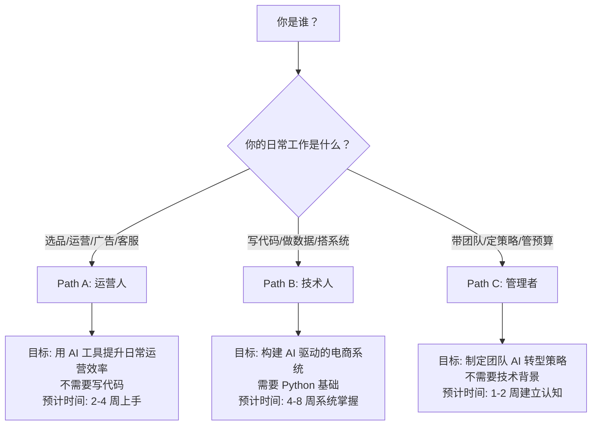

# 学习路径总览 | Learning Paths Overview

> 最后更新: 2026-03-10

AI 正在重塑跨境电商的每一个环节。根据你的角色和目标，选择最适合的学习路径。

---

## 选择你的路径

## 路径对比

| 路径 | 适合谁 | 需要写代码吗 | 时间投入 | 核心产出 |
|------|--------|-------------|----------|----------|
| **[Path A: 运营人](a-operators/)** | 选品/运营/广告/客服岗 | 不需要 | 每天30分钟，2-4周 | 一套可复用的 AI 工作流 |
| **[Path B: 技术人](b-developers/)** | 开发/数据/BI 岗 | 需要 Python | 每天1小时，4-8周 | 一个可部署的 AI 工具 |
| **[Path C: 管理者](c-managers/)** | 团队负责人/创始人 | 不需要 | 集中3-5小时 | 一份 AI 落地规划书 |

> 不确定选哪条？三条路径可以交叉学习。运营人学完 Path A 想深入，可以进 Path B；管理者想了解细节，可以看 Path A 的具体模块。

---

## 快速导航

### [Path A: 运营人 — AI 提效实战](a-operators/)
不写一行代码，用 AI 工具把日常运营效率提升 3-10 倍。包含 6 个模块：选品、Listing、广告、客服、库存、合规。

### [Path B: 技术人 — AI 系统构建](b-developers/)
构建 AI 驱动的电商工具和系统，从脚本到产品级应用。包含 5 个模块：数据管道、预测模型、RAG 知识库、AI Agent、本地模型部署。

### [Path C: 管理者 — AI 战略落地](c-managers/)
理解 AI 能为团队做什么，制定可执行的 AI 落地计划。包含 3 个模块：能力评估、技能建设、ROI 评估。

---

🏠 [返回 Hub 首页](../README.md)
