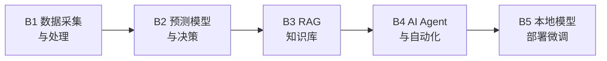

# Path B: 技术人 — AI 系统构建

> 最后更新: 2026-03-10

## 概述

- **目标受众**: 开发/数据/BI 岗位的电商技术人员
- **前提条件**: 有 Python 基础（或愿意边学边做，AI 会帮你写代码）
- **时间投入**: 每天 1 小时，4-8 周系统掌握
- **核心产出**: 一个可部署的 AI 工具

> 构建 AI 驱动的电商工具和系统，从脚本到产品级应用



---

## 模块导航

| 模块 | 主题 | 难度 | 预计时间 | 说明 |
|------|------|------|----------|------|
| [B1. 数据采集与处理自动化](b1-data-pipeline.md) | 数据管道 | ⭐ 入门 | 4-6小时 | 从 Amazon 报告到清洗后的分析数据集 |
| [B2. 预测模型与智能决策](b2-prediction-models.md) | 预测建模 | ⭐⭐ 中级 | 6-8小时 | 销量预测模型，辅助补货决策 |
| [B3. RAG 知识库系统](b3-rag-knowledge-base.md) | 知识库 | ⭐⭐ 中级 | 6-8小时 | 基于内部文档的 AI 问答系统 |
| [B4. AI Agent 与工作流自动化](b4-agent-workflow.md) | Agent | ⭐⭐⭐ 高级 | 8-10小时 | 自动执行多步骤运营任务 |
| [B5. 本地模型部署与微调](b5-local-model-deploy.md) | 模型部署 | ⭐⭐⭐ 高级 | 4-6小时 | 本地运行 LLM，保护数据隐私 |

---

## 进度追踪

```
[ ] B1. 数据：写一个脚本自动合并多个 Amazon 报告并生成汇总
[ ] B2. 预测：用 Prophet 对一个真实 SKU 做 90 天销量预测
[ ] B3. RAG：搭建一个可以回答产品相关问题的 RAG 系统
[ ] B4. Agent：部署一个自动化运营监控 Agent
[ ] B5. 部署：用 Ollama 在本地运行一个 LLM 并完成一个电商任务（选修）
```

**Path B 总完成标志：** 完成 B1-B4 中至少 3 个模块，你已经具备构建 AI 电商工具的能力。B5 为进阶选修。

---

🏠 [返回 Hub 首页](../../README.md) · 📋 [返回路径总览](../README.md)
