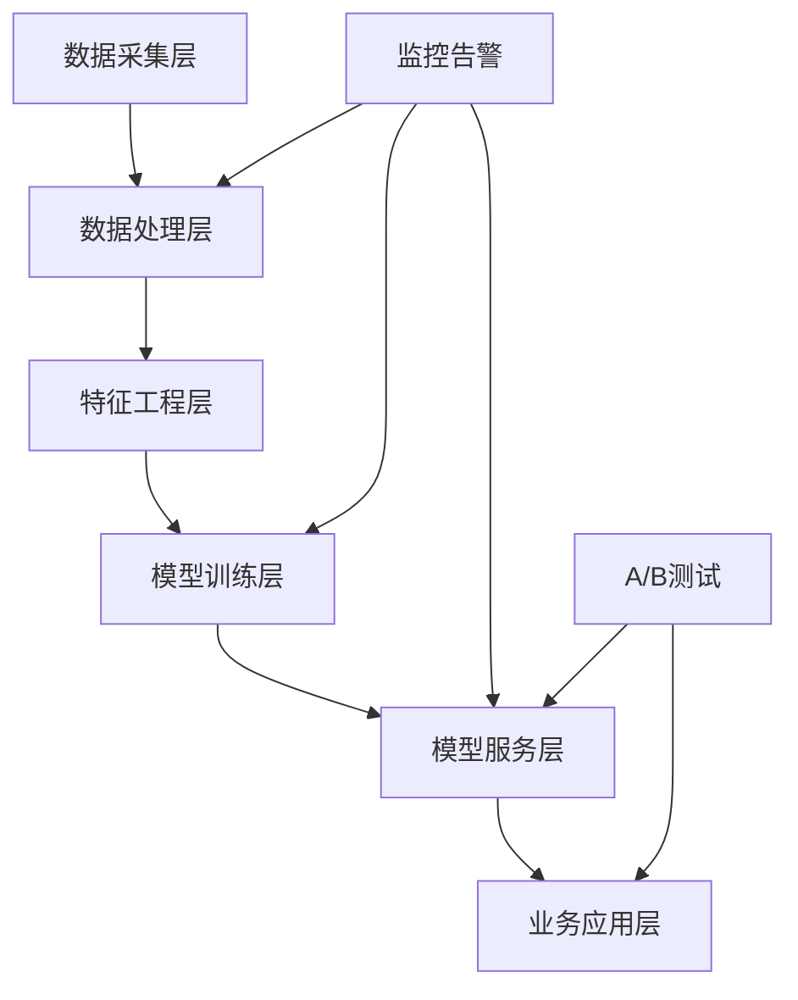

# 跨境电商AI技术实施指南

本文档为跨境电商AI项目提供技术架构、性能基准和实施建议，适用于案例研究的技术方案设计和评估。

## 🛠️ 技术架构模式

### 通用架构组件

### 架构层级说明

**数据采集层**
- 多渠道数据接入（电商平台、ERP、CRM等）
- 实时和批量数据处理
- 数据质量监控和清洗

**数据处理层**
- ETL/ELT管道
- 数据仓库和数据湖
- 数据版本控制和血缘追踪

**特征工程层**
- 特征提取和转换
- 特征存储和管理
- 特征监控和漂移检测

**模型训练层**
- 模型开发和训练
- 超参数优化
- 模型验证和评估

**模型服务层**
- 模型部署和推理
- 负载均衡和扩缩容
- A/B测试和灰度发布

**业务应用层**
- API接口和SDK
- 用户界面和仪表板
- 业务流程集成

### 关键技术选型原则

1. **可扩展性**: 支持业务快速增长
   - 水平扩展能力
   - 微服务架构
   - 云原生设计

2. **多语言支持**: 适应全球化需求
   - 国际化框架
   - 多语言NLP模型
   - 本地化数据处理

3. **实时性**: 满足业务实时决策需求
   - 流式数据处理
   - 低延迟推理
   - 缓存策略优化

4. **可解释性**: 符合合规和审计要求
   - 模型可解释性
   - 决策过程透明
   - 审计日志完整

5. **成本效益**: 平衡性能与成本
   - 资源优化配置
   - 自动化运维
   - 成本监控和控制

## 📊 性能基准

### 模型性能指标

<table width="100%">
<tr>
<th>任务类型</th>
<th>准确率目标</th>
<th>延迟要求</th>
<th>吞吐量</th>
<th>备注</th>
</tr>
<tr>
<td>文本分类</td>
<td>> 90%</td>
<td>< 100ms</td>
<td>1000 QPS</td>
<td>商品分类、情感分析</td>
</tr>
<tr>
<td>推荐系统</td>
<td>CTR > 3%</td>
<td>< 50ms</td>
<td>5000 QPS</td>
<td>商品推荐、个性化</td>
</tr>
<tr>
<td>时间序列预测</td>
<td>MAPE < 20%</td>
<td>< 1s</td>
<td>100 QPS</td>
<td>需求预测、库存优化</td>
</tr>
<tr>
<td>异常检测</td>
<td>F1 > 95%</td>
<td>< 10ms</td>
<td>10000 QPS</td>
<td>欺诈检测、风控</td>
</tr>
<tr>
<td>图像识别</td>
<td>> 95%</td>
<td>< 200ms</td>
<td>500 QPS</td>
<td>商品识别、质检</td>
</tr>
</table>

### 基础设施要求

**计算资源**
- **最小配置**: 2核4GB RAM
- **推荐配置**: 8核16GB RAM
- **高性能配置**: 16核32GB RAM + GPU

**存储要求**
- **系统盘**: SSD，最小100GB
- **数据盘**: 根据数据量，推荐SSD
- **备份**: 异地备份，保留30天

**网络要求**
- **带宽**: 最小100Mbps，推荐1Gbps
- **延迟**: 内网延迟 < 1ms
- **可用性**: 99.9%以上

**容器化支持**
- **Docker**: 支持容器化部署
- **Kubernetes**: 支持集群管理
- **服务网格**: Istio等微服务治理

## 🔄 持续改进

### 模型迭代流程

1. **数据收集**: 持续收集业务反馈数据
   - 用户行为数据
   - 业务指标数据
   - 系统性能数据

2. **性能监控**: 实时监控模型性能指标
   - 准确率监控
   - 延迟监控
   - 资源使用监控

3. **A/B测试**: 新模型与现有模型对比
   - 流量分配策略
   - 统计显著性检验
   - 业务指标对比

4. **渐进部署**: 灰度发布降低风险
   - 金丝雀发布
   - 蓝绿部署
   - 回滚机制

5. **效果评估**: 业务指标和技术指标双重评估
   - ROI计算
   - 用户满意度
   - 系统稳定性

### 质量保证

**代码质量**
- 代码审查流程
- 单元测试覆盖率 > 80%
- 集成测试和端到端测试

**数据质量**
- 数据验证规则
- 数据质量监控
- 异常数据处理

**模型质量**
- 模型验证框架
- 性能基准测试
- 模型偏差检测

## 🛡️ 安全与合规

### 数据安全
- 数据加密（传输和存储）
- 访问控制和权限管理
- 数据脱敏和匿名化

### 隐私保护
- GDPR合规
- 数据最小化原则
- 用户同意管理

### 系统安全
- 网络安全防护
- 漏洞扫描和修复
- 安全审计日志

## 📚 参考资源

### 技术文档
- [AWS机器学习最佳实践](https://docs.aws.amazon.com/wellarchitected/latest/machine-learning-lens/)
- [Google Cloud AI平台指南](https://cloud.google.com/ai-platform/docs)
- [MLOps成熟度模型](https://docs.microsoft.com/en-us/azure/architecture/example-scenario/mlops/mlops-maturity-model)

### 开源工具
- [MLflow](https://mlflow.org/) - 机器学习生命周期管理
- [Kubeflow](https://www.kubeflow.org/) - Kubernetes上的ML工作流
- [DVC](https://dvc.org/) - 数据版本控制

---

**使用说明**: 本指南为案例研究提供技术参考，具体实施时请根据业务需求和资源约束进行调整。如有疑问，请参考[案例库](case-studies.md)中的具体实例或[提交问题](https://github.com/kangise/CBEC-AI-Hub/issues)。
